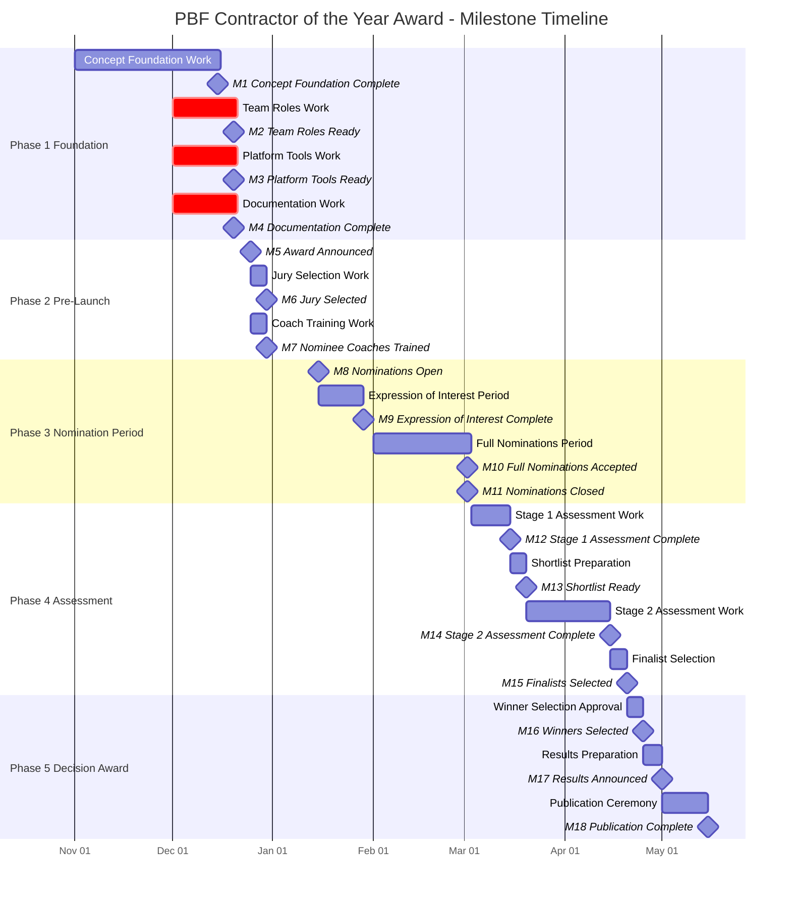

# Jira Issues Export - PBF Contractor of the Year Award

**Epic:** PBF-17 - Key Milestones  
**Project:** PBF  
**Export Date:** 2025-12-04  
**Status:** Draft - To be reworked to align with new concepts

---

## Proposed Milestone Structure

**Note:** 
- Dates are illustrative and should be adjusted based on actual program timeline
- Work periods show estimated duration for activities leading to milestones
- Milestones marked with `:crit` indicate critical path dependencies
- Actual dates will be determined during project planning

### Milestone Descriptions

#### Phase 1: Foundation & Setup

**M1: Concept & Foundation Complete**
- Award Credo finalized
- Research findings integrated
- Evaluation framework aligned
- Submission package updated with new sections
- GDPR policy defined

**M2: Team & Roles Ready**
- Team recruited
- Nominee Coaches identified and assigned
- Role guides created (high-level complete, detailed content in progress)
- Project Manager assigned
- Communications Coordinator assigned

**M3: Platform & Tools Ready**
- SurveyMonkey account configured
- Three-survey structure implemented:
  - Nomination survey
  - Expression of Interest survey
  - Client Assessment survey
- Excel template for Client Assessment Form created
- Platform integrated with ITTD/PBF websites

**M4: Documentation Complete**
- Process Map complete with subpages
- Roles and RACI page updated (Nominee Coach Model)
- All Confluence pages aligned with new concepts
- GDPR guidance integrated
- Submission Package includes all new sections

#### Phase 2: Pre-Launch

**M5: Award Announced**
- Public announcement made
- Award criteria communicated
- Nomination period dates published
- Communication materials ready

**M6: Jury Selected**
- Judging Panel members identified
- Conflicts of interest checked
- Jury briefed on evaluation framework
- Governance protocol confirmed

**M7: Nominee Coaches Trained**
- Coaches briefed on process
- Coaches trained on submission package requirements
- Coaches understand GDPR guidance
- Coach assignment process ready

#### Phase 3: Nomination Period

**M8: Nominations Open**
- Nomination survey live
- Expression of Interest survey live
- Platform accessible
- Support channels active

**M9: Expression of Interest Period**
- Companies expressing interest
- Basic information collected
- Categorization confirmed (headcount-based)
- Nominee Coaches assigned

**M10: Full Nominations Accepted**
- Complete submission packages received
- Completeness checks performed
- Eligibility validated
- Nominees assigned to Coaches

**M11: Nominations Closed**
- Nomination deadline passed
- All submissions validated
- Final count confirmed
- Ready for assessment

#### Phase 4: Assessment

**M12: Stage 1 Assessment Complete**
- All nominations evaluated by volunteers/assessors
- Scores calculated
- Shortlist criteria applied
- Feedback prepared

**M13: Shortlist Ready**
- Top candidates identified per category
- Shortlist communicated to nominees
- Stage 2 preparation begins

**M14: Stage 2 Assessment Complete**
- Judging Panel presentations completed
- Q&A sessions finished
- Final scores calculated
- Recommendations prepared

**M15: Finalists Selected**
- Finalists identified
- Winners recommended
- Appeals period (if applicable)
- Final approval pending

#### Phase 5: Decision & Award

**M16: Winners Selected**
- Final approval obtained
- Winners notified (under embargo)
- Finalists notified
- Non-winners notified

**M17: Results Announced**
- Public announcement made
- Results published on ITTD website
- Results published on PBF website
- Press releases issued

**M18: Publication Complete**
- Case studies published
- Award ceremony completed (if applicable)
- Feedback collected
- Data archived per retention policy
- Program closed for cycle

---

## Epic: PBF-17 - Key Milestones

**Type:** Epic  
**Status:** To Do  
**Priority:** Medium  
**Created:** 2025-10-14  
**Updated:** 2025-10-14  
**Assignee:** None  
**Description:** (None)

---

## Milestones (Linked to Epic PBF-17)

### PBF-18: Scope and Concepts Done
**Type:** Milestone  
**Status:** To Do  
**Priority:** Medium  
**Created:** 2025-10-14  
**Updated:** 2025-10-22  
**Assignee:** None  
**Description:** (None)

---

### PBF-19: Award Announcement
**Type:** Milestone  
**Status:** To Do  
**Priority:** Medium  
**Created:** 2025-10-14  
**Updated:** 2025-10-17  
**Assignee:** None  
**Description:** (None)

---

### PBF-20: Ready for Jury Selection
**Type:** Milestone  
**Status:** To Do  
**Priority:** Medium  
**Created:** 2025-10-14  
**Updated:** 2025-11-12  
**Assignee:** None  
**Description:** (None)

---

### PBF-21: Jury Selected
**Type:** Milestone  
**Status:** To Do  
**Priority:** Medium  
**Created:** 2025-10-14  
**Updated:** 2025-10-14  
**Assignee:** None  
**Description:** (None)

---

### PBF-22: Ready to accept Nominations
**Type:** Milestone  
**Status:** To Do  
**Priority:** Medium  
**Created:** 2025-10-14  
**Updated:** 2025-10-14  
**Assignee:** None  
**Description:** (None)

---

### PBF-23: Nominations Closed
**Type:** Milestone  
**Status:** To Do  
**Priority:** Medium  
**Created:** 2025-10-14  
**Updated:** 2025-10-14  
**Assignee:** None  
**Description:** (None)

---

### PBF-24: Jury Elaboration Finished
**Type:** Milestone  
**Status:** To Do  
**Priority:** Medium  
**Created:** 2025-10-14  
**Updated:** 2025-10-14  
**Assignee:** None  
**Description:** (None)

---

### PBF-25: Results Announcment
**Type:** Milestone  
**Status:** To Do  
**Priority:** Medium  
**Created:** 2025-10-14  
**Updated:** 2025-10-14  
**Assignee:** None  
**Description:** (None)

---

### PBF-26: Nominations Accepted
**Type:** Milestone  
**Status:** To Do  
**Priority:** Medium  
**Created:** 2025-10-14  
**Updated:** 2025-10-27  
**Assignee:** None  
**Description:** (None)

---

### PBF-58: Team Recruitment
**Type:** Milestone  
**Status:** To Do  
**Priority:** Medium  
**Created:** 2025-10-22  
**Updated:** 2025-10-22  
**Assignee:** None  
**Description:** (None)

---

## Notes for Rework

### Current State Analysis:
- All issues are currently Milestones (not Tasks/Stories)
- No assignees assigned
- No descriptions provided
- All in "To Do" status
- Structure is milestone-based, not task-based

### Alignment Needed with New Concepts:
1. **Nominee Coach Model** - Need tasks for coach assignment, training, guidance document creation
2. **Award Credo & Research Findings** - Need tasks for communication, integration into materials
3. **GDPR Compliance** - Need tasks for data retention policy implementation, guidance creation
4. **Submission Package Updates** - Need tasks for new sections (Exemplary, Impact, Lessons Learned)
5. **Process Map Subpages** - Need tasks for maintaining/updating process documentation
6. **Role Guides** - Need tasks for creating detailed content for each role guide
7. **Platform Setup** - SurveyMonkey setup, three-survey structure implementation
8. **Client Assessment Form** - Excel template creation (delegated)
9. **Expression of Interest Survey** - New survey creation
10. **Publication & Recognition** - ITTD and PBF website publication tasks

### Recommended Structure:
- Convert milestones to actionable tasks/stories
- Group by workstream/phase
- Assign clear owners
- Add acceptance criteria
- Link to Confluence documentation
- Add dependencies

---

## Next Steps:
1. Review and rework milestones into actionable tasks
2. Organize by workstream (Concept, Platform, Process, Team, Operations)
3. Add detailed descriptions and acceptance criteria
4. Assign owners and set priorities
5. Create task dependencies
6. Align with process phases (Submission, Assessment, Decision/Award)

