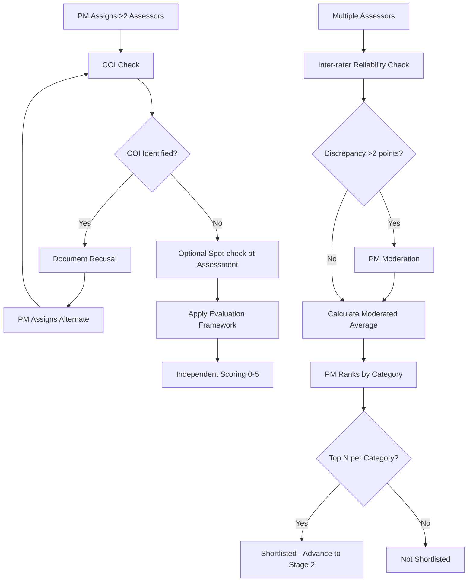
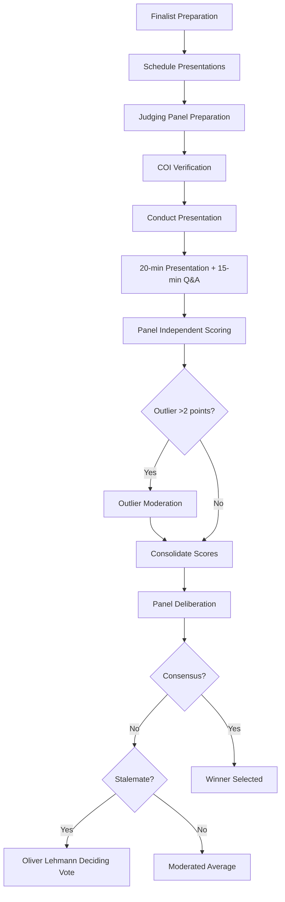

> **Updated post-UAT Jun 2026 — Coach role removed.** See [DR-002 — Drop Nominee Coach role (Post-UAT)](https://ittd.atlassian.net/wiki/spaces/PBF/pages/245989377).

# 2.0 Assessment

This section covers the two-stage assessment process: Stage 1 (independent assessor screening) and Stage 2 (Judging Panel evaluation).

**Parent page:** [Process Map](https://ittd.atlassian.net/wiki/spaces/PBF/pages/117866524)

**Prerequisite:** Nominations are **eligible and complete** after [1.0 Intake](https://ittd.atlassian.net/wiki/spaces/PBF/pages/130514945) (automated pre-screening + PM exceptions). Stage 1 focuses on **scoring and shortlist**, not first-pass completeness.

---

## 2.1 Stage 1 – Independent Assessor Screening and Evaluation

**Objective:** Apply the evaluation framework, score independently, and produce a per-category shortlist

**Accountability:** **Project Manager / Award Operations** — assessor assignment (≥2 per nomination), COI/quorum, moderation, shortlist lock. **Communications Coordinator** sends shortlist / not-shortlisted notifications (Stage E — not part of 2.1 scoring).

**Key activities (Stage 1 ops — PM / WS4):** Assign ≥2 assessors per nomination; track COI recusals; moderate inter-rater discrepancies; rank by category; lock shortlist.

**Key activities (Assessors):** Independent scoring on all 9 criteria; evidence-based comments; optional finalist prep support if requested by PM.

**RACI (2.1):**

* **Responsible:** Assessors (scoring)
* **Accountable:** Project Manager (assignment, COI/quorum, moderation, shortlist lock)
* **Consulted:** Assessors, Communications Coordinator (notification timing after shortlist)
* **Informed:** Applicant (via Comms after shortlist decision)

---

## 2.2 Stage 2 – Judging Panel Presentation & Q&A

**Objective:** Final evaluation of shortlisted nominees through presentations and Q&A, determine winners

Finalists present and answer Q&A; judges rescore with emphasis on exemplariness and Innovation & Industry Advancement.

---

**Previous phase:** [1.0 Submission and Intake](https://ittd.atlassian.net/wiki/spaces/PBF/pages/130514945)  
**Next phase:** [3.0 Decision/Award](https://ittd.atlassian.net/wiki/spaces/PBF/pages/130547713)
