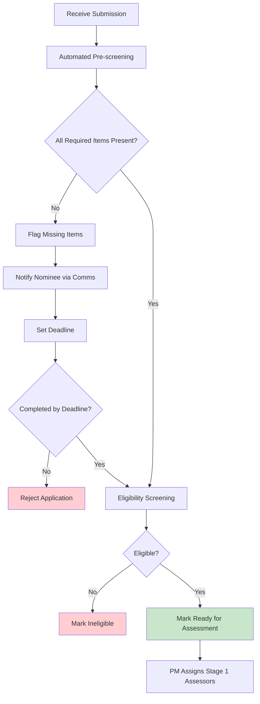

> **Updated post-UAT Jun 2026 — Coach role removed.** See [DR-002 — Drop Nominee Coach role (Post-UAT)](https://ittd.atlassian.net/wiki/spaces/PBF/pages/245989377).

# 1.0 Submission and Intake

This section covers the nomination submission process and initial validation of applications.

**Parent page:** [Process Map](https://ittd.atlassian.net/wiki/spaces/PBF/pages/117866524)

---

## 1.1 Nomination Submission

**Objective:** Collect complete nomination packages from contractors

**Process Steps:**

1. **Nominee initiates nomination**

    * Nominee accesses nomination platform/form
    * Creates account/profile
    * Starts nomination process
    
2. **Complete written submission (≤2,000 words)**

    * Nominee completes narrative covering objectives, scope/baseline, outcomes vs baseline, interface & governance, commercial/contract model and liquidity, risk handling, integrity controls
    * Save as draft (can be edited before final submission)
    * **GDPR Reminder:** Minimize personal data — use roles/titles instead of names where possible
    
3. **Complete required sections:** "What Makes This Exemplary?" (500 words), "Impact Measurement & Transformation" (300 words), "Lessons Learned & Industry Contribution" (300 words)
4. **Upload evidence artifacts** (contract matrix, interface RACI, People Development metric, code of conduct, integrity plan)
5. **Obtain Client Assessment Form** (client completes, signs, uploads; nominee enters totals)
6. **Complete nomination form**, accept publication consent and data-retention acknowledgements, **submit**
7. **System validation** — platform validates required fields, artifacts, client form, file formats

**SLA:** Submission confirmation within X days of application being fully submitted

**RACI:**

* **Responsible:** Applicant
* **Accountable:** Project Manager
* **Consulted:** Pre-screening agent (validation on submit)
* **Informed:** Project Manager

---

## 1.2 Intake and Initial Validation

**Objective:** Verify completeness and eligibility via automated pre-screening; PM handles exceptions

**Process Steps:**

1. **Receive submission confirmation** — automatic email with reference number, timeline, dashboard link, data-retention reminder
2. **Automated pre-screening (within 24 hours)**

    * Pre-screening agent checks:
    
        * Written submission and all required sections
        * Evidence artifacts present
        * Client Assessment Form completed and linked
        * Eligibility criteria (project type, completion window, category inputs)
        * GDPR red flags (excessive personal data — guidance only)
        
    * **Does not score** or judge quality (DR-002)
    
3. **Exception handling (Project Manager)**

    * Review agent flags and edge cases
    * Approve or reject borderline eligibility
    * Escalate blockers to Programme Owner if needed
    
4. **Handle incomplete applications**

    * Pre-screening agent flags missing items on the dashboard
    * **Communications Coordinator** sends the missing-items notification (template) — typically triggered by the platform workflow after pre-screen
    * Set deadline; automated reminders
    * Reject if not completed by deadline
    
5. **Mark Ready for Assessment** — PM assigns assessors (≥2 per nomination, COI-checked)
6. **Application lifecycle visibility** — dashboard status updated throughout
7. **Respond to applicant questions** — program support / PMO inbox (not a volunteer coach)

**SLA:**

* Validation checks within X days
* Incomplete applications initiated within X days
* Follow-up requests from CotY within X days from last correspondence
* Applicant questions responded within X days
* Application lifecycle visibility published within X days

**RACI:**

* **Responsible:** Pre-screening agent (checks); Project Manager (exceptions); Communications Coordinator (missing-item emails)
* **Accountable:** Project Manager
* **Consulted:** Assessors (not yet assigned at intake)
* **Informed:** Applicant

---

## Data Protection & Retention

* All nomination materials retained for **1 year** after award cycle completion
* **GDPR applies only to personal data**

---

**Next phase:** [2.0 Assessment](https://ittd.atlassian.net/wiki/spaces/PBF/pages/129204226)
