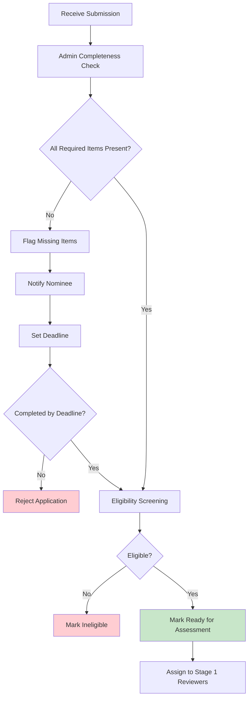

# 1.0 Submission and Intake

This section covers the nomination submission process and initial validation of applications.

**Parent page:** [Process Map](https://ittd.atlassian.net/wiki/spaces/PBF/pages/117866524)

---

## 1.1 Nomination Submission

**Objective:** Collect complete nomination packages from contractors

**Process Steps:**

1. **Nominee initiates nomination**

    * Nominee accesses nomination platform/form
    * Creates account/profile
    * Starts nomination process
    
2. **Complete written submission (≤2,000 words)**

    * Nominee completes narrative covering:
    
        * Objectives
        * Scope/baseline
        * Outcomes vs baseline
        * Interface & governance
        * Commercial/contract model and liquidity
        * Risk handling
        * Integrity controls
        
    * Save as draft (can be edited before final submission)
    * **GDPR Reminder:** Minimize personal data - use roles/titles instead of names where possible
    
3. **Complete "What Makes This Exemplary?" section (500 words - Required)**

    * Nominee explains what sets this project apart from a "good" project
    * Addresses:
    
        * What sets this apart? (exceptional vs competent)
        * Innovation & Uniqueness (novel approaches, pioneering techniques, challenges to industry norms)
        * Broader Impact (beyond project success, what changed?)
        * Industry Contribution (how does this advance the field?)
        
    * This section is evaluated as part of "Innovation & Industry Advancement" criterion
    
4. **Complete "Impact Measurement & Transformation" section (300 words - Required)**

    * Nominee provides evidence of measurable, lasting impact:
    
        * Quantifiable outcomes (specific metrics)
        * Transformation evidence (how project changed client's business)
        * Long-term benefits (impact 6-12 months after completion)
        * ROI or value demonstration (beyond contract value)
        
    * This section is evaluated as part of "Project success (outcomes)" criterion
    
5. **Complete "Lessons Learned & Industry Contribution" section (300 words - Required)**

    * Nominee shares knowledge that benefits the profession:
    
        * What did you learn? (key insights)
        * Knowledge Sharing (publications, presentations, templates, mentoring, case studies)
        * Industry Contribution (how has this influenced your approach? How might it influence others?)
        * Replicability (what practices could others adopt?)
        
    * This section is evaluated as part of "Innovation & Industry Advancement" criterion
    
6. **Upload evidence artifacts**

    * Draft contract matrix (obligations, applicable law, jurisdiction, warranties/liability, notice and change mechanisms)
    * Customer-contractor interface RACI (provisions and enabling services)
    * People Development metric: Percentage of net income/profit invested in staff development (0%, 0-5%, or 5%+)
    * Code of conduct acknowledgment
    * Integrity plan (aligned to cross-corporate template)
    * **GDPR Reminder:** Ensure uploaded documents minimize personal data
    
7. **Obtain Client Assessment Form**

    * Nominee provides QR code or link to client representative
    * Client completes Client Assessment Form:
    
        * Rates 7 criteria (0-10 scale) with weights
        * Calculates Weight × Rating for each criterion
        * Provides total score and % achieved
        * Adds evidence notes for ratings ≥8 or ≤4
        * Signs and provides consent for:
        
            * Evaluation and communications
            * Short story publication (if winner or top 3 finalist)
            
        * Client uploads signed PDF (or Excel version)
    * Nominee enters total score and % achieved in nomination form
    
8. **Complete nomination form**

    * Enter all required information
    * Upload all evidence artifacts
    * Link Client Assessment Form
    * Accept publication consent for short case profile
    * **Acknowledge data retention policy (1 year retention)**
    * **Acknowledge GDPR guidance (minimize personal data)**
    * Submit nomination
    
9. **System validation**

    * Platform validates:
    
        * All required fields completed
        * All evidence artifacts uploaded
        * Client Assessment Form linked and completed
        * All three required sections completed (Written submission, "What Makes This Exemplary?", "Impact Measurement & Transformation", "Lessons Learned & Industry Contribution")
        * File formats correct
        * File sizes within limits
        
    

**SLA:** Submission confirmation within X days of application being fully submitted

**RACI:**

* **Responsible:** Applicant
* **Accountable:** Nominee Coach (assigned at submission)
* **Consulted:** Project Manager (for coach assignment)
* **Informed:** Project Manager

---

## 1.2 Intake and Initial Validation

**Objective:** Verify completeness and eligibility, provide visibility to applicants

**Process Steps:**

1. **Receive submission confirmation**

    * System sends automatic confirmation to nominee
    * Confirmation includes:
    
        * Submission reference number
        * Expected timeline for review
        * Link to track application status
        * **Data retention policy reminder (1 year retention)**
        
    
2. **Admin completeness check (within 24 hours)**

    * Nominee Coach reviews submission for completeness:
    
        * Written submission present (≤2,000 words)
        * "What Makes This Exemplary?" section completed (500 words)
        * "Impact Measurement & Transformation" section completed (300 words)
        * "Lessons Learned & Industry Contribution" section completed (300 words)
        * All evidence artifacts uploaded
        * Client Assessment Form completed and signed
        * All required fields filled
        * Publication consent provided
        * **GDPR compliance check** - Flag if excessive personal data is present (provide guidance if needed)
        
    
3. **Eligibility screening**

    * Verify eligibility criteria:
    
        * Project type: cross-corporate customer-contractor project
        * Independent contractor for paying client under contract
        * Completion window: completed within last 2 years (2024-2025) or currently running
        * Project category classification (headcount-based: 1-10, 11-100, 101+)
        
    
4. **Application lifecycle visibility**

    * Update platform with application status
    * Publish status to nominee dashboard
    * Track: Submitted → Under Review → Eligible/Ineligible → Shortlisted/Not Shortlisted → Finalist/Not Finalist → Winner/Not Winner
    
5. **Handle incomplete applications**

    * If incomplete:
    
        * Flag missing items
        * Send notification to nominee with specific missing requirements
        * Set deadline for completion
        * Follow up if not completed within deadline
        
    * If complete and eligible:
    
        * Mark as "Ready for Assessment"
        * Assign to Stage 1 reviewers
        
    
6. **Respond to applicant questions**

    * Monitor applicant inquiries
    * Provide responses within SLA
    * Update FAQ if common questions arise
    

**SLA:**

* Validation checks within X days
* Incomplete applications (missing info) initiated within X days
* Follow-up requests from CotY within X days from last correspondence
* Applicant questions responded within X days
* Application lifecycle visibility published within X days

**RACI:**

* **Responsible:** Nominee Coach
* **Accountable:** Project Manager
* **Consulted:** Other Nominee Coaches (for consistency)
* **Informed:** Applicant, Project Manager

---

## Data Protection & Retention

**Data Retention Policy:**

* All nomination materials will be retained for **1 year** after the award cycle completion
* After 1 year, materials will be archived or deleted per retention policy
* **GDPR applies only to personal data** - Company/project data is not subject to GDPR requirements

**GDPR Compliance:**

* Nominees are advised to minimize personal data in submissions
* Use roles/titles instead of names where possible
* Focus on project outcomes and organizational achievements
* See [Submission Package](https://ittd.atlassian.net/wiki/spaces/PBF/pages/98598913) for detailed GDPR guidance

---

**Next phase:** [2.0 Assessment](https://ittd.atlassian.net/wiki/spaces/PBF/pages/129204226)

