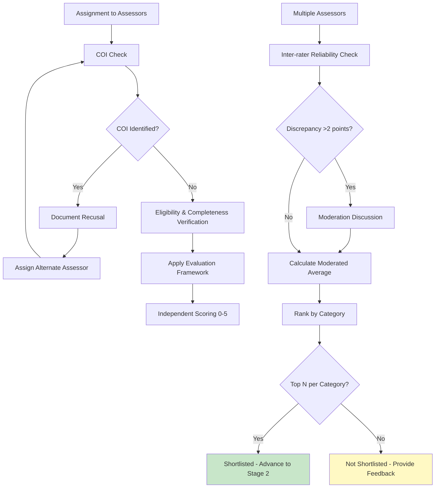
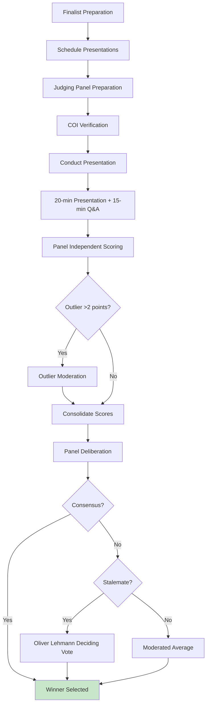

# 2.0 Assessment

This section covers the two-stage assessment process: Stage 1 (Volunteer Screening) and Stage 2 (Judging Panel Evaluation).

**Parent page:** [Process Map](https://ittd.atlassian.net/wiki/spaces/PBF/pages/117866524)

---

## 2.1 Stage 1 – Volunteer Screening and Evaluation

**Objective:** Screen for eligibility/completeness, apply evaluation framework, and shortlist top candidates per category

**Process Steps:**

1. **Assignment to assessors**

    * Nominee Coach assigns nominations to volunteer assessors
    * Ensure minimum 2-3 independent reviewers per nomination
    * Check COI declarations before assignment
    * Assign based on:
    
        * Category expertise
        * Workload balance
        * COI-free status
        
    
2. **COI check and recusal**

    * Each assessor reviews assigned nominations for COI
    * If COI identified:
    
        * Assessor immediately notifies Nominee Coach
        * Nominee Coach documents recusal
        * Assigns alternate assessor
        * Records in audit trail
        
    * Verify quorum after recusals
    
3. **Eligibility and completeness verification**

    * Assessors verify:
    
        * Client Assessment Form present and signed
        * All evidence artifacts present
        * All required sections completed (Written submission, "What Makes This Exemplary?", "Impact Measurement & Transformation", "Lessons Learned & Industry Contribution")
        * Eligibility criteria met
        * Project completion window valid
        * Category classification correct (headcount-based: 1-10, 11-100, 101+)
        
    
4. **Apply Evaluation Framework (0-5 scale)**

    * Each assessor independently scores using Evaluation Framework:
    
        * Project success (outcomes) - including measurable impact and transformation
        * Agility & adaptability
        * Commercial model (liquidity impact)
        * Legal soundness
        * Interface and governance
        * Risk management (cross-corporate)
        * People Development
        * Team and business acumen (Integrity and conduct)
        * **Innovation & Industry Advancement** - What makes this exemplary? Industry contribution, knowledge sharing, replicability
        
    * Score each criterion (0-5) with weights
    * Provide per-criterion comments and evidence notes
    * Consider contract type (fixed-price vs T&M) as applicable
    * **Special attention to "Innovation & Industry Advancement"** - Winners should score 4-5 on this criterion
    
5. **Inter-rater reliability check**

    * Compare scores from multiple assessors
    * Identify significant discrepancies (>2 points from median)
    * Flag for moderation/review if needed
    * Calculate moderated average
    
6. **Shortlisting**

    * Calculate final scores per nomination
    * Rank nominations within each category:
    
        * Small organizations (1-10 people)
        * Medium organizations (11-100 people)
        * Large organizations (101+ people)
        
    * Select top N per category for Stage 2
    * **Prioritize nominations with high scores (4-5) on "Innovation & Industry Advancement"**
    * Document shortlist decisions
    
7. **Notification and feedback**

    * **Notify all applicants** of shortlist status:
    
        * Shortlisted: Advance to Stage 2, receive presentation instructions
        * Not shortlisted: Receive feedback from PBF identifying areas that can be strengthened for future submissions
        
    * Send notifications via email/platform
    * Update application status in system
    

**SLA:**

* Pre-Judging assessment: Assignment to assessor(s) within X days
* Pre-Judging assessment: Assessment complete within X days

**RACI:**

* **Responsible:** Assessors
* **Accountable:** Nominee Coach (for their assigned nominees)
* **Consulted:** Other Nominee Coaches (for consistency), Project Manager (for block removal)
* **Informed:** Applicant, Nominee Coach

---

## 2.2 Stage 2 – Judging Panel Presentation & Q&A

**Objective:** Final evaluation of shortlisted nominees through presentations and Q&A, determine winners

**Process Steps:**

1. **Finalist preparation**

    * Shortlisted nominees receive:
    
        * Presentation requirements (max 10 slides)
        * Required coverage areas:
        
            * Outcomes vs baseline
            * Interface/governance
            * Commercial/liquidity
            * Risk
            * Integrity
            * **What makes this exemplary?** (from "What Makes This Exemplary?" section)
            * **Measurable impact and transformation** (from "Impact Measurement & Transformation" section)
            * **Lessons learned and industry contribution** (from "Lessons Learned & Industry Contribution" section)
            
        * Instructions to include:
        
            * Signed Client Assessment summary
            * At least two artifacts (interface RACI snapshot, People Development metric)
            
        * Presentation recording consent form
        * Scheduling information
        
    
2. **Schedule presentations**

    * Coordinate with finalists for presentation times
    * Account for time zones
    * Schedule 20-minute presentation + 15-minute Q&A slots
    * Confirm judging panel availability
    * Send calendar invitations
    
3. **Judging panel preparation**

    * Verify COI declarations for all panel members
    * Document any recusals
    * Verify quorum after recusals
    * Provide Q&A question template to panel
    * Brief panel on:
    
        * Evaluation Framework
        * Scoring scale (0-5)
        * **Special emphasis on "Innovation & Industry Advancement"** - Winners should demonstrate they did something uniquely valuable
        * Outlier moderation procedures
        * Decision-making protocol
        
    
4. **Conduct presentations**

    * Facilitator manages session:
    
        * Introduces finalist
        * Tracks time (20 minutes presentation, 15 minutes Q&A)
        * Manages Q&A session using standardized question template
        * **Q&A should probe: "Why should you win? What makes this exemplary?"**
        * Records responses
        * Manages recusals if COI arises during presentation
        
    * Record presentation (with consent)
    * Panel members take notes and score independently
    
5. **Panel scoring**

    * Each panel member independently scores using same Evaluation Framework (0-5 scale)
    * Considers:
    
        * Presentation content
        * Q&A responses (especially on what makes them exemplary)
        * Client Assessment Form scores
        * Evidence artifacts
        * **"What Makes This Exemplary?" section**
        * **"Impact Measurement & Transformation" section**
        * **"Lessons Learned & Industry Contribution" section**
        
    * Submit scores per criterion
    * **Special attention to "Innovation & Industry Advancement"** - Winners should score 4-5
    
6. **Outlier moderation**

    * Identify scores >2 points from median
    * Facilitator moderates discussion on outliers
    * Panel members may adjust scores or provide justification
    * Document outlier discussions
    
7. **Consolidation and deliberation**

    * Calculate moderated average scores
    * Panel reviews top candidates
    * Consider:
    
        * Client Assessment scores
        * Presentation quality
        * Q&A responses (especially on exemplariness)
        * **Overall excellence across criteria, with emphasis on Innovation & Industry Advancement**
        * **Case study worthiness** - Would we want to publish this? Would others learn from this?
        
    * Deliberate on winners per category
    * **Deciding factor:** Is this truly exemplary, not just competent?
    
8. **Final decision**

    * Reach consensus or use moderated average
    * If stalemate: Oliver Lehmann has final deciding vote
    * Document decision rationale
    * Verify audit trail completeness
    

**SLA:**

* Judging assessment: Assignment to panel member(s) within X days
* Judging assessment: Assessment complete within X days

**RACI:**

* **Responsible:** Judging Panel members
* **Accountable:** Project Manager
* **Consulted:** Nominee Coach (for their nominees' presentations)
* **Informed:** Applicant, Nominee Coach

---

**Previous phase:** [1.0 Submission and Intake](https://ittd.atlassian.net/wiki/spaces/PBF/pages/130514945)    
**Next phase:** [3.0 Decision/Award](https://ittd.atlassian.net/wiki/spaces/PBF/pages/130547713)

