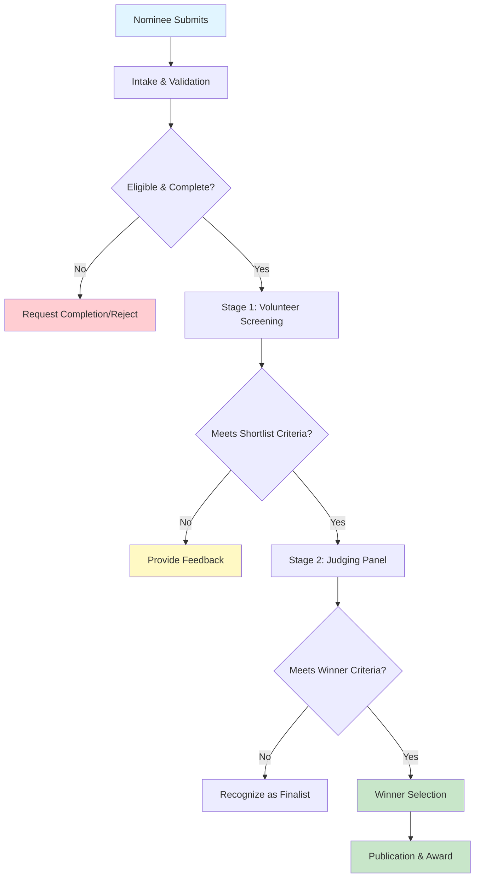
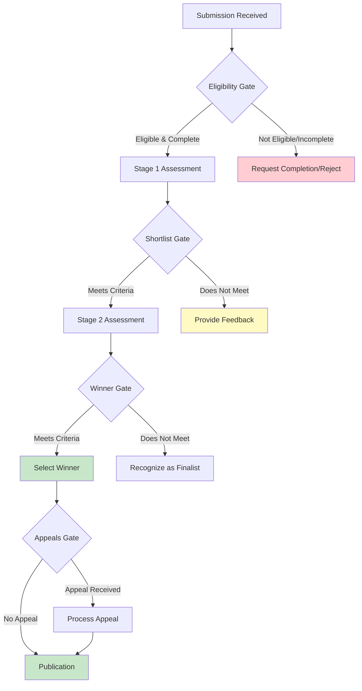

# Process Map

Cover: Submission → Assessment → Award process. This page provides an overview of the complete process lifecycle with links to detailed subpages for each phase.

## Overview

This process map covers the complete lifecycle from Submission → Assessment → Award for the PBF Contractor of the Year program. The process follows a two-stage evaluation model with volunteer screening (Stage 1) and judging panel evaluation (Stage 2).

---

## End-to-End Process Flow

---

## Process Phases

### [1.0 Submission and Intake](https://ittd.atlassian.net/wiki/spaces/PBF/pages/130514945)

Covers nomination submission, completeness checks, and eligibility validation.

**Key sub-processes:**

* 1.1 Nomination Submission
* 1.2 Intake and Initial Validation

**Key outputs:** Complete, eligible nominations ready for Stage 1 assessment

---

### [2.0 Assessment](https://ittd.atlassian.net/wiki/spaces/PBF/pages/129204226)

Covers the two-stage evaluation process.

**Key sub-processes:**

* 2.1 Stage 1 – Volunteer Screening and Evaluation
* 2.2 Stage 2 – Judging Panel Presentation & Q&A

**Key outputs:** Shortlisted nominees (Stage 1), Winners selected (Stage 2)

---

### [3.0 Decision/Award](https://ittd.atlassian.net/wiki/spaces/PBF/pages/130547713)

Covers winner selection, notification, and award publication.

**Key sub-processes:**

* 3.1 Winner Selection and Notification
* 3.2 Award Publication and Ceremony

**Key outputs:** Winners notified, Award published on ITTD and PBF websites

---

## Key Decision Points

1. **Eligibility Gate** (1.2): Is nomination eligible and complete?

    * Yes → Proceed to Stage 1
    * No → Request completion or reject
    
2. **Shortlist Gate** (2.1): Does nomination meet shortlist criteria?

    * Yes → Proceed to Stage 2
    * No → Provide feedback, end process
    
3. **Winner Gate** (2.2): Does finalist meet winner criteria?

    * Yes → Select as winner
    * No → Recognize as finalist
    
4. **Appeals Gate** (3.1): Is there an appeal?

    * Yes → Process appeal
    * No → Proceed to publication
    
---

## Quality Gates

* **Completeness Gate:** All required materials submitted
* **Eligibility Gate:** Meets eligibility criteria
* **COI Gate:** No conflicts of interest in evaluation
* **Quorum Gate:** Sufficient evaluators available after recusals
* **Quality Gate:** Minimum 2-3 independent reviews completed
* **Documentation Gate:** All decisions documented with rationale

---

## Handoffs Between Phases

1. **Intake → Stage 1:** Complete, eligible nominations assigned to assessors
2. **Stage 1 → Stage 2:** Shortlisted nominations prepared for judging panel
3. **Stage 2 → Decision:** Finalist scores and recommendations provided to Programme Owner
4. **Decision → Award:** Approved winners provided to Communications Lead for publication

---

## Metrics and Monitoring

* **Average Intake Time:** Σ (Eligibility Decision – Submission Date) ÷ # applications
* **Assessment SLA Compliance %:** (# assessments completed within SLA) ÷ (total assessments) × 100
* **Applicant Satisfaction Score:** (Positive responses ÷ total responses) × 100
* **End-to-End Cycle Time:** Award Date – Submission Date

---

## Notes for Review

* All SLA values (X days) need to be defined based on operational capacity
* Process assumes platform/system supports workflow automation
* Appeals process details need to be finalized
* Publication locations confirmed: ITTD website and PBF website
* Ceremony format (virtual vs in-person) needs decision
* Data retention policy: 1 year retention (GDPR applies only to personal data)

---

_This process map should be reviewed and approved before implementation. All stakeholders should review and provide feedback._

