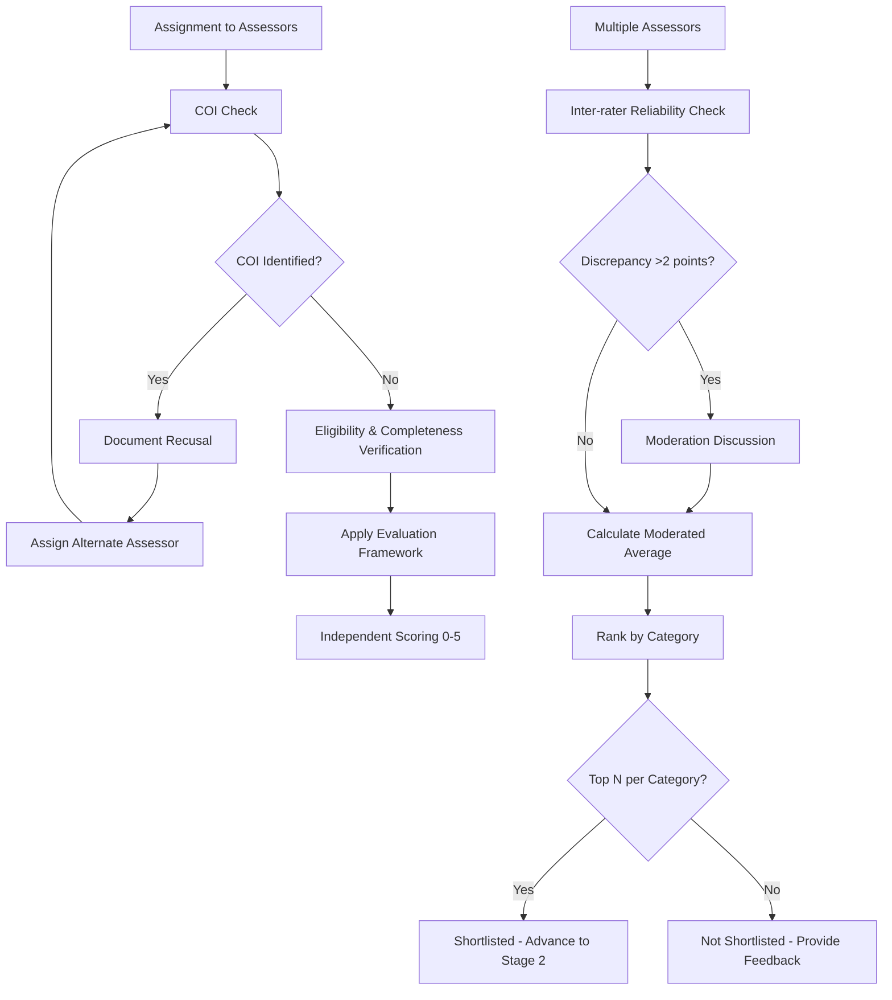
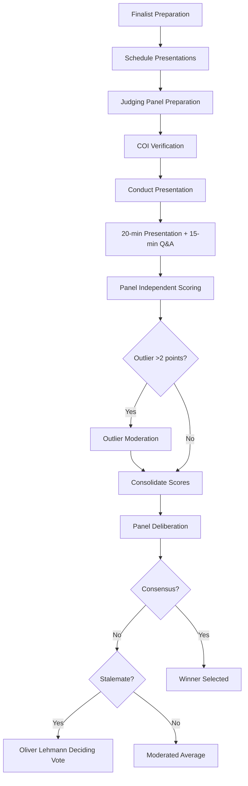

# 2.0 Assessment

- Page ID: `129204226`
- URL: `https://ittd.atlassian.net/wiki/spaces/PBF/pages/129204226`

## Body

# 2.0 Assessment

This section covers the two-stage assessment process: Stage 1 (Volunteer Screening) and Stage 2 (Judging Panel Evaluation).

**Parent page:** [Process Map](https://ittd.atlassian.net/wiki/spaces/PBF/pages/117866524)

---

## 2.1 Stage 1 – Volunteer Screening and Evaluation

**Objective:** Screen for eligibility/completeness, apply evaluation framework, and shortlist top candidates per category

Key activities include assessor assignment, COI recusal handling, independent scoring across all 9 criteria, inter-rater moderation, category ranking, and applicant notifications.

---

## 2.2 Stage 2 – Judging Panel Presentation & Q&A

**Objective:** Final evaluation of shortlisted nominees through presentations and Q&A, determine winners

Finalists present and answer Q&A; judges rescore with emphasis on exemplariness and Innovation & Industry Advancement.

---

**Previous phase:** [1.0 Submission and Intake](https://ittd.atlassian.net/wiki/spaces/PBF/pages/130514945)  
**Next phase:** [3.0 Decision/Award](https://ittd.atlassian.net/wiki/spaces/PBF/pages/130547713)
