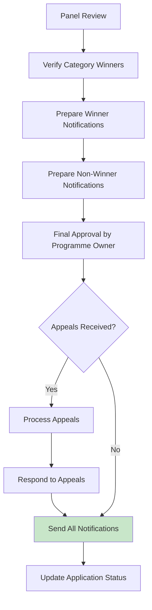

# 3.0 Decision/Award

- Page ID: `130547713`
- URL: `https://ittd.atlassian.net/wiki/spaces/PBF/pages/130547713`

## Body

# 3.0 Decision/Award

This section covers winner selection, notification, and award publication.

**Parent page:** [Process Map](https://ittd.atlassian.net/wiki/spaces/PBF/pages/117866524)

---

## 3.1 Winner Selection and Notification

**Objective:** Finalize winners, prepare notifications, and manage appeals

**Process Steps:**

1. **Panel/consolidated review**

    * Review all finalist scores
    * Verify category winners
    * Confirm overall Contractor of the Year winner (if applicable)
    * Document final decisions
    * Prepare decision rationale
    
2. **Prepare winner notifications**

    * Generate winner notification letters/templates
    * Include:
    
        * Award category
        * Recognition details
        * Next steps (publication, ceremony, etc.)
        * Publication consent reminders
        
    * Prepare under embargo until official announcement
    
3. **Prepare non-winner notifications**

    * Generate notifications for finalists who did not win
    * Include:
    
        * Recognition of finalist status
        * Appreciation for participation
        * Feedback on areas of strength
        * Invitation to apply in future cycles
        
    
4. **Appeals process (if applicable)**

    * Publish appeals process and deadline
    * Receive appeals (if any)
    * Review appeals per defined process
    * Respond to appeals within defined timeline
    * Document appeal outcomes
    
5. **Final approval**

    * Programme Owner reviews and approves final decisions
    * Verify all documentation complete
    * Confirm publication consents obtained
    * Approve for announcement
    
6. **Send notifications**

    * Send winner notifications (under embargo)
    * Send finalist notifications
    * Send non-finalist notifications (if not already sent)
    * Update application statuses in platform
    * Track notification delivery
    

**SLA:**

* Panel/consolidated review within X days
* Final approval outcome/decision to each applicant within X days

**RACI:**

* **Responsible:** Communications Lead, Assessment team
* **Accountable:** Programme Owner
* **Consulted:** Assessment team, Judging Panel
* **Informed:** Applicants

---

## 3.2 Award Publication and Ceremony

**Objective:** Publicly recognize winners and publish results

**Process Steps:**

1. **Award letter generation**

    * Generate formal award letters/certificates
    * Include:
    
        * Winner name/organization
        * Category
        * Award year
        * Recognition statement
        
    * Obtain signatures/approvals
    * Prepare for delivery
    
2. **Prepare publication materials**

    * Write short case stories for:
    
        * Contractor of the Year winner
        * Top 3 finalists (if applicable)
        
    * Obtain final publication consents
    * Prepare press releases
    * Prepare social media content
    * Prepare ceremony materials (if applicable)
    
3. **Virtual ceremony production (if applicable)**

    * Plan ceremony format and agenda
    * Prepare presentation materials
    * Coordinate with winners for participation
    * Record ceremony (if applicable)
    * Prepare for broadcast/publication
    
4. **Publication of award results**

    * Publish on **both ITTD website and PBF website** (framed as cooperation)
    * Publish in relevant journals/publications (as decided)
    * Issue press releases
    * Post on social media
    * Update platform with public results
    * Publish methodology summary
    
5. **Post-award activities**

    * Collect feedback from:
    
        * Winners
        * Finalists
        * Judging panel members
        * Volunteers/assessors
        
    * Conduct applicant satisfaction survey
    * **Archive nomination materials per retention policy:**
    
        * **Retention period: 1 year** after award cycle completion
        * **GDPR compliance:** Personal data (if any) will be handled per GDPR requirements
        * **After 1 year:** Materials will be archived or deleted per retention policy
        * **Note:** GDPR applies only to personal data - company/project data is not subject to GDPR requirements
        
    * Update SOPs based on lessons learned
    * Prepare annual report/metrics
    

**SLA:**

* Award letter generation within X days
* Publication of award results within X days (noting appeals period/cooling off if applicable)

**RACI:**

* **Responsible:** Communications Lead
* **Accountable:** Programme Owner
* **Consulted:** Assessment team, Judging Panel
* **Informed:** Applicants, Public

---

**Previous phase:** [2.0 Assessment](https://ittd.atlassian.net/wiki/spaces/PBF/pages/129204226)
