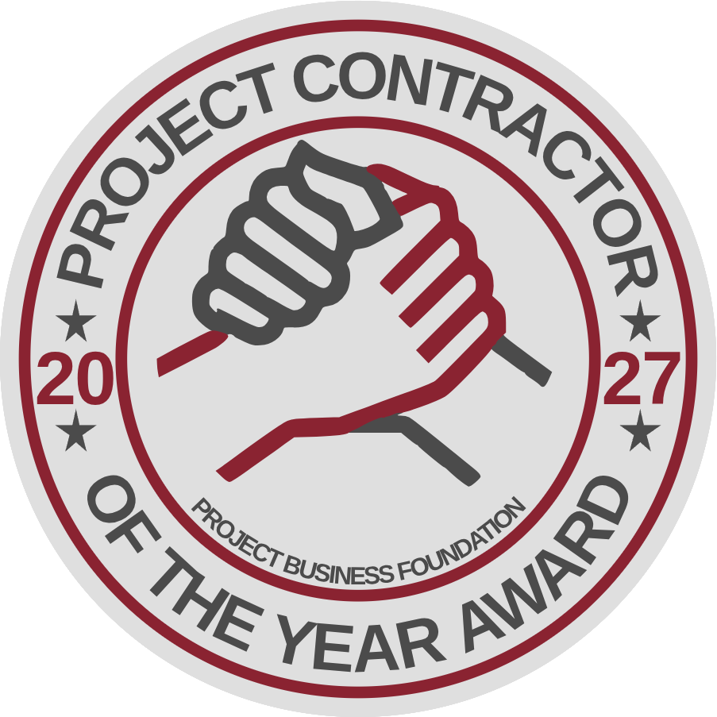

  

# Contractor of the Year Nominee Guide

**Nomination and submission guide for the Project Contractor of the Year (PCoTY) Award 2027**

For contractors preparing a nomination.

**Apply:** [ittd.space/pbf-pcoty](https://www.ittd.space/pbf-pcoty)

Nominations open **1 September 2026** and close **31 October 2026**. The customer evaluation closes on the same date.

---

## Contents

- [Introduction](#introduction)
- [Eligibility](#eligibility)
- [How the cycle works](#how-the-cycle-works)
- [Submission process](#submission-process)
- [Required narrative components](#required-narrative-components)
- [Evidence requirements](#evidence-requirements)
- [Customer evaluation](#customer-evaluation)
- [Data protection and retention (GDPR)](#data-protection-and-retention-gdpr)
- [Submission checklist](#submission-checklist)
- [After you submit](#after-you-submit)

---

## Introduction

This guide covers what you need to prepare a complete, checkable nomination for the Project Contractor of the Year (PCoTY) Award 2027.

The award looks for contractors who move beyond competence toward excellence: not only fulfilling the contract, but leaving a result others in the profession can learn from.

You can save a draft and return to it until you submit. Word counts below are **ceilings, not targets**. Nobody scores extra for filling them.

---

## Eligibility

- **Project type:** a cross-corporate customer-contractor project, in any industry, where you acted as an independent contractor for a paying client under contract.
- **Timing:** completed in 2024-2025, or still running at nomination.
- **Two-actor requirement:** a client representative must complete the customer evaluation. Without that form, the nomination is incomplete.
- **Publication:** you accept publication of a short case profile if you are a winner or top-3 finalist.

Categories are assigned at intake from **headcount on customer projects** (not internal work or admin): Small 1-25, Medium 26-100, Large 101+. Shortlisting is per category.

---

## How the cycle works

1. **Submit** on the platform. Save as draft until you are ready.
2. **Intake.** An automated check reviews eligibility, completeness, and attachments, usually within about a day. Missing items are flagged on your dashboard. Program support sends a templated note if something is still outstanding.
3. **Stage 1.** At least two independent assessors score the packet on nine criteria (0-5).
4. **Stage 2.** If shortlisted, you present to the judging panel: 20 minutes plus 15 minutes of questions.
5. **Award.** Winners and finalists are notified through the platform and program communications.

There is **no Nominee Coach** for this cycle. Track status on your dashboard. Questions go to program support through the platform help channel.

---

## Submission process

1. **Sign up** at [ittd.space/pbf-pcoty](https://www.ittd.space/pbf-pcoty) and start a nomination.
2. **Build the packet.** Write the four narrative sections, upload the evidence files, and enter your customer representative's details.
3. **Customer evaluation.** We email your client a unique link. They complete their own form. You cannot fill it in, forward the link, or upload it on their behalf. Warn them it is coming, and that it is due by **31 October**.
4. **Submit** before the close. You can edit until you click Submit.
5. If you pass Stage 1, prepare the presentation and Q&A for the panel.

---

## Required narrative components

Write for clarity, data, and the *why* behind the result. Use roles and company names, not personal names, unless a named testimonial is essential and you have consent.

### 1. Project narrative (up to 2,000 words)

Upload as a file. Cover:

- **Objectives and scope.** What was the baseline?
- **Outcomes.** How did results compare to that baseline?
- **Governance.** Interface management and project oversight.
- **Commercials.** Contract model, liquidity, and risk handling.
- **Integrity.** Controls and ethical safeguards.

### 2. What makes this exemplary? (up to 500 words)

This feeds **Innovation & Industry Advancement** (Criterion 9), which is what separates winners from competent delivery.

- **Innovation.** Novel approaches or pioneering techniques.
- **Broader impact.** What changed for the client's business or the community?
- **Industry contribution.** What can peers learn from this?

If this section could describe any well-run project in your sector, it is not finished.

### 3. Impact and transformation (up to 300 words)

This feeds **Project Success**. Show lasting value 6-12 months after completion (or the equivalent if the project is still running).

- **Metrics.** Quantifiable data (for example, "reduced processing time by 40%").
- **ROI.** Value created beyond the contract price.

### 4. Lessons learned (up to 300 words)

- **Knowledge sharing.** How are you mentoring others or publishing the findings?
- **Replicability.** Which practices should become a new standard?

---

## Evidence requirements

Upload these artifacts to back the narrative. Anonymise personal data (see GDPR below).

- **Draft contract matrix.** Jurisdiction, liability, notice, and change mechanisms.
- **Customer-contractor interface RACI.** Provisions and enabling services at the boundary.
- **People development metric.** Share of net income or profit invested in staff development. Categories: 0%, 0-5%, or 5%+.
- **Code of conduct acknowledgment.** Aligned to a cross-corporate template.
- **Integrity plan.** Aligned to a cross-corporate template.

---

## Customer evaluation

The client's view is a scored part of the nomination, not a reference letter.

1. Enter the customer representative's **work email** in the nomination. A wrong address fails silently: the link goes nowhere and nobody is told, including you.
2. Tell them the email is coming, who it is from, and that it is not phishing.
3. They receive a unique link and rate **seven criteria on a 0-10 scale**, with weights. They add evidence notes for high or low scores and sign publication consent.
4. Their form must be in by **31 October**, the same close as yours.

Pick someone who still works there and still answers email.

---

## Data protection and retention (GDPR)

Minimise personal data. GDPR applies to personal data, not company or project facts.

### Minimisation

- Use **roles, not names**: "Project Manager", not "John Smith".
- Use **organisational** emails and addresses, not personal ones.
- If a name is essential (a specific testimonial), obtain written consent first.

### Retention

- Materials are retained for **1 year** after the award cycle completes.
- After that they are archived or deleted under ITTD policy.

---

## Submission checklist

- [ ] Project narrative uploaded (up to 2,000 words)
- [ ] "What makes this exemplary?" completed (up to 500 words)
- [ ] Impact and transformation completed (up to 300 words)
- [ ] Lessons learned completed (up to 300 words)
- [ ] Draft contract matrix
- [ ] Customer-contractor interface RACI
- [ ] People development metric
- [ ] Code of conduct acknowledgment
- [ ] Integrity plan
- [ ] Customer representative details entered (correct work email)
- [ ] Customer warned that the evaluation email is coming
- [ ] Publication consent accepted
- [ ] Personal data minimised in every file

---

## After you submit

You receive a confirmation with a reference number and a link to track status.

Typical statuses: Submitted, Under review, Eligible / Ineligible, Shortlisted / Not shortlisted, Finalist / Not finalist, Winner / Not winner.

If something is missing, the dashboard flags it and program support sends a note. That only helps while there is calendar left, for you and for your client.

Questions: platform help channel or program support. There is no volunteer coach for this cycle.
