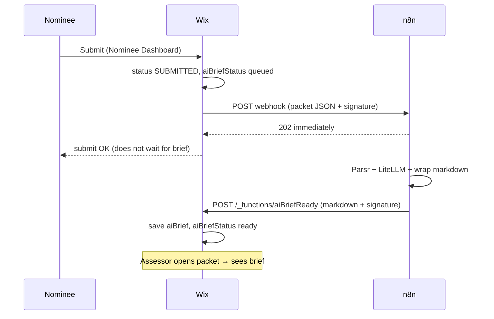
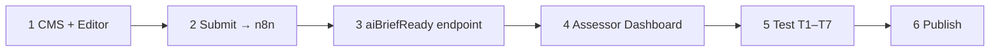

# AI assessor brief — Wix build guide

**Owner:** Peter · **Site repo:** `ittdspace/` (`github.com/baloghp/ittdspace`)  
**n8n (done):** [02-n8n-workflow.md](02-n8n-workflow.md) · **Sign helper:** [sign.js](sign.js) · **Prompt:** [prompts/system.md](prompts/system.md)

---

## What we are building

When a nominee clicks **Submit** on the **Nominee Dashboard**, Wix tells **n8n** to generate an AI working paper. When n8n finishes, it calls a **Wix HTTP endpoint** that saves the result on that **Nominations** row. **Assessors** read it on the **Assessor Dashboard** packet view.


| #     | Task                                                        | Where                       |
| ----- | ----------------------------------------------------------- | --------------------------- |
| **1** | Add CMS fields on `Nominations` for the brief + status      | Wix CMS + Editor            |
| **2** | On **final submit**, call the n8n webhook (fire-and-forget) | `backend/nomination.web.js` |
| **3** | Add an HTTP endpoint n8n calls back with the markdown       | `backend/http-functions.js` |
| **4** | Show the brief + manual re-run on Assessor Dashboard | Assessor Dashboard page |


**n8n is built and tested** (webhook 202, full pipeline, POST Wix — 404 until step 3 exists). This document is the **Wix side only**.

---


## The loop




**Important:** Submit does **not** wait for the brief (~minutes). Parsr + LiteLLM run in n8n after the **202** ack.

---


## Product rules (do not change)

- **When:** automatically on **final submit**; manually via **Run AI brief again** on Assessor Dashboard (`failed`, missing, or re-run).
- **Who sees it:** assessors (and admin) on Assessor Dashboard — **not** the nominee.
- **What it is:** packet snapshot + evidence map (nine criteria: found / thin / missing). **No scores.** Sliders stay human-only.
- **Storage:** markdown in CMS (`aiBrief`). Wix converts to HTML for the rich-text box — not in n8n.
- **Failure:** if n8n is down, `aiBriefStatus = failed`; nominee submit still succeeds; assessor can retry with the button.
- **Re-run:** last successful write-back wins (`aiBrief` overwritten). Nominee cannot trigger re-run.

---


## Task 1 — CMS fields (`Nominations`)

In Local Editor (`cd ittdspace && npm run dev`). **Sync** when done.


| Field           | Type              | Purpose                               |
| --------------- | ----------------- | ------------------------------------- |
| `aiBrief`       | Text (multi-line) | Markdown from n8n. Empty until ready. |
| `aiBriefAt`     | Date              | When n8n write-back succeeded         |
| `aiBriefStatus` | Text              | `queued` → `ready` or `failed`        |


Do **not** add fields on `Assessments` or `Customer_Feedback`.

### Assessor Dashboard (Editor)

Place **`#btnRunAIBriefAgain`** **outside** the Tabs element (always visible when a nomination is open). Place **`#richTextBoxAiBrief`** where you want it in the Editor (e.g. on the AI BRIEF tab) — **Wix Tabs** control visibility; code does **not** collapse or hide either element.

| Control | ID | Notes |
| --- | --- | --- |
| Run again | `#btnRunAIBriefAgain` | Outside Tabs |
| AI brief | `#richTextBoxAiBrief` | Read-only; empty until `ready`; Wix Tabs handle visibility if inside a tab |

Do **not** add these on Nominee Dashboard.

**Checklist**

- [x] `aiBrief`, `aiBriefAt`, `aiBriefStatus` on `Nominations`
- [x] `#btnRunAIBriefAgain` outside Tabs; `#richTextBoxAiBrief` on page (Editor placement)
- [ ] Synced to `ittdspace`

---


## Task 2 — Enqueue n8n (submit + manual re-run)

Use **one shared backend function** for both paths so the payload and signature stay identical.

**Suggested:** `enqueueAiBrief(nominationId)` in `src/backend/aiBrief.web.js` (implemented).

It should:

1. Load the `Nominations` row by id.
2. Build the same JSON as [golden-packet-webhook.json](n8n/fixtures/golden-packet-webhook.json).
3. `fetch` n8n webhook; await **202 only**. **Do not** write `aiBriefStatus` / clear brief on enqueue (Wix `update` replaces the whole item — a partial patch wipes the packet).
4. On failure → return `{ ok: false }` to caller; leave CMS unchanged. Nominee submit still succeeds.

### Path A — automatic (final submit)

**File:** `src/backend/nomination.web.js` — inside `saveNomination`, when `isFinal === true`:

Call `enqueueAiBrief(nominationId)` after the row is saved as `SUBMITTED`.  
**Do not** fail nominee submit if enqueue fails (emails etc. still run).

### Path B — manual (Assessor Dashboard)

**File:** new web method e.g. `runAiBriefAgain(nominationId)` — called from `#btnRunAIBriefAgain`.

- Verify caller is **assessor** (or admin) with access to that nomination.
- Call the same `enqueueAiBrief(nominationId)`.
- Disable button while `aiBriefStatus === 'queued'`; show status label if helpful.

**Nominee saves must never write `aiBrief*`** — strip those keys from nominee POST data.

### Payload Wix sends to n8n

Same shape as [n8n/fixtures/golden-packet-webhook.json](n8n/fixtures/golden-packet-webhook.json):


| Field                                             | Source                                     |
| ------------------------------------------------- | ------------------------------------------ |
| `_id`                                             | nomination id                              |
| `ts`                                              | unix seconds (must match signature header) |
| `title`, `company`                                | CMS                                        |
| `exemplary`, `impact`, `lessons`                  | rich text HTML                             |
| `mainNarrative`, `fileContractMatrix`, `fileRaci` | file URLs                                  |


No PDF bytes. No customer evaluation.

### n8n webhook URL


| Environment       | URL                                                                 |
| ----------------- | ------------------------------------------------------------------- |
| **Production**    | `https://automate.ittd.app/webhook/pcoty-ai-brief`                  |
| **Preview / dev** | use `-test` URL only for manual curl while workflow is in test mode |


Workflow must be **Active** for production URL.

### Auth on Wix → n8n

Headers on every submit:


| Header            | Value                           |
| ----------------- | ------------------------------- |
| `X-PBF-Timestamp` | same as body `ts`               |
| `X-PBF-Signature` | `pbfSign(root, \`${ts}.${_id})` |


Copy `pbfSign` from [sign.js](sign.js). Root string lives in `backend/aiBriefSecret.js` — same value as n8n Config `hmacRoot`.

---


## Task 3 — HTTP endpoint for n8n write-back

**File:** `src/backend/http-functions.js` + `src/backend/aiBriefReady.js`  
**Route:** `POST /_functions/aiBriefReady` (Preview: `/_functions-dev/aiBriefReady`)

`suppressAuth: true` — n8n is not a Wix member.

### Request n8n sends

Headers: same sign scheme, canonical `{ts}.{nominationId}.{status}`.

Body (JSON):

```json
{
  "nominationId": "…",
  "status": "ready",
  "ts": 1788171121,
  "markdown": "…",
  "model": "deepseek/deepseek-v4-flash",
  "generatedAt": "2026-08-31T10:15:00.000Z"
}
```

On failure n8n sends `"status": "failed"` and `"error": "…"` (no `markdown`).

### Handler must

1. Verify `X-PBF-Signature` and `X-PBF-Timestamp` (±300 s window).
2. `wixData.get` the nomination, merge brief fields onto the full row, then `update` — if `markdown` present → `aiBrief` + `aiBriefAt`; set `aiBriefStatus` from body `status` (default `ready` when markdown sent). Never pass a partial object to `update`.
3. Return **200** JSON `{ ok: true }`. No DRAFT/SUBMITTED checks.

---


## Task 4 — Assessor Dashboard (display + re-run)

**Files:** `src/pages/Assessor Dashboard .b7c5p.js`, `src/public/aiBriefPanel.js`, `src/backend/aiBrief.web.js` (`convertAiBriefMarkdown`, `getNominationAiBriefSnapshot`)

### Brief box (`#richTextBoxAiBrief`)

When a nomination is loaded, code sets `.value` from stored markdown (converted to HTML when `ready`, otherwise empty). **No collapse/hide** — layout is Editor/Wix Tabs only.

### Re-run button (`#btnRunAIBriefAgain`)

Outside Tabs. On click: fire-and-forget `runAiBriefAgain(nominationId)` (backend POST to n8n; no wait for result). **One click per page load** — button stays disabled with label **Request sent — refresh in 3–5 min**, and an Alert tells the assessor to refresh in about 3–5 minutes. A full page refresh unlocks the button again. No polling.

**Never** copy brief text into scoring sliders. Sliders remain assessor-only.

---


## Shared secret (`aiBriefSecret.js`)

Create `src/backend/aiBriefSecret.js`:

```javascript
// Same string as n8n Config hmacRoot. Backend only — never import from pages.
export const AI_BRIEF_ROOT = '…';

export function pbfSign(root, canonical) {
  let h = 2166136261;
  const s = String(root) + String(canonical);
  for (let i = 0; i < s.length; i++) {
    h ^= s.charCodeAt(i);
    h = Math.imul(h, 16777619);
  }
  return (h >>> 0).toString(16).padStart(8, 'hex');
}
```

Or re-export from a copy of [sign.js](sign.js).

---


## Build order




| Step | Who          | Done when                                 |
| ---- | ------------ | ----------------------------------------- |
| 1    | You (Editor) | CMS fields + `#richTextBoxAiBrief` + `#btnRunAIBriefAgain` synced |
| 2    | Cursor       | `aiBrief.web.js` + `saveNomination` hook (done) |
| 3    | Cursor       | `post_aiBriefReady` in `http-functions.js` (done) |
| 4    | Cursor       | `aiBriefPanel.js` + Assessor Dashboard (done) |
| 5    | You          | T1–T7 below pass in Preview               |
| 6    | You          | Publish site; n8n workflow **Active**     |


---


## Test plan


| #   | Scenario                          | Pass when                                                            |
| --- | --------------------------------- | -------------------------------------------------------------------- |
| T1  | Submit a complete test nomination | `aiBriefStatus` goes `queued` → `ready`; brief on Assessor Dashboard |
| T2  | Top of brief                      | Banner + metadata; machine-guide disclaimer                          |
| T3  | Customer eval submitted later     | Brief **unchanged**                                                  |
| T4  | Assessor opens packet             | Brief visible; sliders empty / own draft                             |
| T5  | Nominee dashboard                 | No brief shown                                                       |
| T6  | Submit with a missing file        | Brief still generates; snapshot notes missing                        |
| T7  | n8n down                          | `failed`; assessor can still score; **Run again** visible |
| T8  | Click `#btnRunAIBriefAgain` on failed row | `queued` → `ready`; new brief replaces old |


---


## n8n reference (already built)

Do not rebuild n8n unless something breaks. See [02-n8n-workflow.md](02-n8n-workflow.md).

Production webhook: `https://automate.ittd.app/webhook/pcoty-ai-brief`  
Write-back URL for n8n Config `wixAiBriefUrl`: `https://www.ittd.space/_functions-dev/aiBriefReady` (Preview) or `/_functions/aiBriefReady` (live).

---


## Governance

- Human sliders remain the only scores ([DR-002](../../Program-Plan/Decisions/DR-002-Drop-Nominee-Coach.md)).
- Packets may contain personal data — Parsr + LiteLLM on your instances; minimal logging.
- Do not feed the AI brief into the calibration exam pass/fail.

