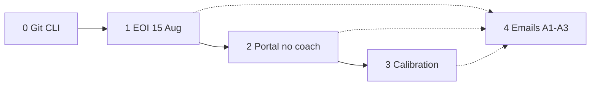

# Assessor Wix — guide

**Owner:** Peter · **EOI go-live:** 15 Aug 2026 · **Site repo:** `ittdspace/` (`github.com/baloghp/ittdspace`)

**Specs:** [Platform spec](../../Confluence/Project-Contractor-Of-The-Year-Award/284196865%20-%20Stage%201%20Assessor%20Platform%20Spec.md) · [Recruitment](../../Confluence/Project-Contractor-Of-The-Year-Award/263618649%20-%20Assessor%20Recruitment%20Strategy%20—%20Cycle%201.md) · [DR-002](../../Confluence/Project-Contractor-Of-The-Year-Award/245989377%20-%20DR-002%20—%20Drop%20Nominee%20Coach%20role%20(Post-UAT).md)

Two pages. Do not mix them.

| Page | URL today | Purpose |
| --- | --- | --- |
| **EOI landing** (public) | [ittd.space/uat-nda](https://www.ittd.space/uat-nda) | Why assess · offer · form |
| **Assessor portal** (members) | Coach Dashboard (assessor page is empty) | Score assigned nominations |

Work in **this folder**. One phase file at a time. Do not expand a later phase until the earlier gate is published.

| Phase | Gate | File |
| --- | --- | --- |
| 0 | CLI works | [00-git-and-cli.md](Assessor-Wix/00-git-and-cli.md) |
| 1 | **15 Aug** — EOI live | [01-eoi-landing.md](Assessor-Wix/01-eoi-landing.md) |
| 2 | After EOI — portal, no coach | [02-assessor-portal.md](Assessor-Wix/02-assessor-portal.md) |
| 3 | Before Nov — theory + exam | [03-calibration.md](Assessor-Wix/03-calibration.md) |
| 4 | Emails (A1–A3 with phase 1; rest with 2–3) | [04-emails.md](Assessor-Wix/04-emails.md) |

Same `Assessors` CMS row from first contact through scoring. Do not create `AssessorEOI`.

**Out of scope for this programme:** n8n pre-screen, auto member-provision from EOI, PDU/O1 issuance, moderation UI, public campaign before Oliver go/no-go, Wix Learn / second LMS.
