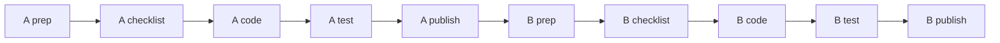
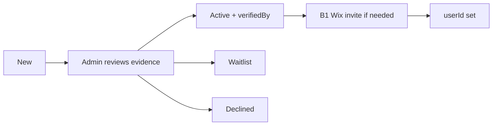

# Phase 2 — Assessor portal + Admin (kill coach)

**Gate:** One Assessor member portal (no coach); Admin verifies/activates EOI assessors and assigns assessors only.  
**Back:** [Guide](../Assessor-EOI-Wix-Plan.md) · **After:** [phase 1](01-eoi-landing.md) live · **Email catalogue:** [04](04-emails.md)

DR-002: no Nominee Coach. Do **not** copy code onto empty `Assessor Dashboard.d94bg.js`. Working UI is **Coach Dashboard** (`Coach Dashboard.b7c5p.js`).

Leave CMS `coachAssignedId` in place; **stop writing it**.

---

## How to use this file (order)

Finish **Page A** completely (including publish or a clean Local Editor gate) before starting **Page B**.  
On each page: do not ask Cursor for code until that page's **pre-code checklist** is fully ticked.

| Page | What | Order |
| --- | --- | --- |
| **A** | Assessor portal (redo Coach Dashboard) | Prep → emails (if any) → checklist → code → test → publish |
| **B** | Admin Dashboard (no coach + verify/activate) | Same pattern |

---

# Page A — Assessor portal

**Goal:** Members with Assessor role open one dashboard: assigned nominations, read-only packet, score/submit. No coach UI anywhere on this path.

**Page file (after Sync):** still `src/pages/Coach Dashboard.b7c5p.js` until/unless Wix renames the file on Sync — do not rename the `.js` in git by hand first.

---

## A1 — Prep (Local Editor + related pages)

Do this in Local Editor (`npm run dev`). Sync when the UI is right.

### A1.1 Portal page (Coach Dashboard → Assessor Dashboard)

1. Open **Coach Dashboard**.
2. Rename page title to **Assessor Dashboard** (editor rename only).
3. **Hide or delete** coach UI:
   - `#boxCoachView`, `#coachTable`, `#searchCoach`
   - Coach Diary tab and `#coachDiaryRichText`, `#saveDiaryBtn`, `#cbCOI`, `#dropdownCategory`
4. **Keep:**
   - `#assessorTable`, `#searchAssessor`
   - Nomination tabs: packet + customers + assessment
   - `#boxAssessmentContent`, scoring sliders, draft/submit
5. Check mobile layout for the assessor table + assessment panel.
6. **Sync** design into `ittdspace`.

### A1.2 Empty Assessor Dashboard page

- Unpublish (or remove from menus) the empty **Assessor Dashboard** page so there is only **one** portal URL.

### A1.3 Homepage

- Relabel `#btnCoach` to **Assessor** (button text in Local Editor).
- Note for Cursor: show this button **only** for Assessor role (code change in Step A4).

### A1.4 Nominee Dashboard

- Hide or delete `#coachText` / any "your coach" label in Local Editor if present.
- Cursor will also strip `coachNameDisplay` in code.

### A1.5 CMS

- **No new CMS fields** for Page A.
- Confirm `Nominations.assessors[]` and live assessment storage still work as today.
- Do **not** delete `coachAssignedId`.

### A1.6 Emails for Page A

- **No new Triggered Emails** required to ship the portal strip.
- Assignment emails **C1–C5** wait until Admin can assign (Page B) and you are ready to wire them — not a Page A gate.
- **B1** (set-password) is the native **Wix member invite**, not a Triggered Email you design here.

---

## A2 — Pre-code checklist (Page A gate)

Tick all before asking Cursor for Page A code.

- [ ] Coach Dashboard renamed to Assessor Dashboard in Local Editor
- [ ] Coach table / diary / coach-only controls hidden or deleted
- [ ] Assessor table + packet + customers + assessment still visible
- [ ] Empty Assessor Dashboard unpublished / not linked
- [ ] Homepage button label says Assessor
- [ ] Nominee "your coach" UI hidden or noted for code
- [ ] Local Editor **Synced** to `ittdspace`
- [ ] Mobile check on portal page done

**When all ticked:** ask Cursor to implement **Step A3**.

---

## A3 — Code (Cursor; only after A2)

Strip coach; keep assessor scoring.

| File | Change |
| --- | --- |
| `pages/Coach Dashboard.b7c5p.js` | Assessor-only; drop coach table, diary, `currentRoleView === 'COACH'` |
| `backend/coach.web.js` | Keep `getAssessorNominations` + customer fetch; delete diary / coach COI / coach-gated rollup |
| `public/coachDiaryPanel.js`, `public/diaryTemplate.js` | Delete |
| `pages/Contractor Of The Year Award.z9t1g.js` | `#btnCoach` only for Assessor |
| `pages/Nominee Dashboard.myj3i.js` + `backend/nomination.web.js` | Remove coach display |
| `backend/multiRole.web.js` | Drop `Coaches` query and `"Nominee Coach"` |
| `public/cycleConfig.js` | Remove `'Nominee Coach'` from `STAFF_ROLES` |

Optional later rename: `coach.web.js` → `assessor.web.js` (can be a follow-up commit).

Do **not** rebuild the assessment form. Do **not** implement Admin EOI queue here (that is Page B).

---

## A4 — Verify and test (Page A)

### A4.1 Smoke

- [ ] Portal loads for a test Assessor member without console errors
- [ ] No coach table / diary visible
- [ ] Homepage shows Assessor (not Coach) for Assessor role; hidden for pure nominees
- [ ] Nominee dashboard has no "your coach"

### A4.2 Scenarios

| # | Scenario | Steps | Pass when |
| --- | --- | --- | --- |
| A-T1 | Assessor sees assignments | Log in as test assessor with ≥1 nom in `assessors[]` | Rows in `#assessorTable` |
| A-T2 | Packet read-only | Open a nomination | Packet + customers visible; no nominee edit controls |
| A-T3 | Draft + submit | Score, save draft, submit | Draft persists; submit locks as today |
| A-T4 | No coach path | Attempt any former coach-only control | Gone or inert |
| A-T5 | Role gate | Log in without Assessor role | No Assessor homepage button / no portal access as designed |
| A-T6 | Mobile | Repeat A-T1–A-T3 on narrow width | Usable |

### A4.3 Failures

| Symptom | Check |
| --- | --- |
| Empty table | `userId` on Assessors vs `Nominations.assessors[]`; `getAssessorNominations` |
| Coach UI still shows | Local Editor leftover elements; page code still toggling COACH |
| Wrong homepage button | `multiRole` / `Contractor Of The Year Award` role checks |

---

## A5 — Publish (Page A)

- [ ] A4 scenarios passed
- [ ] Commit + push `main` in `ittdspace/`
- [ ] Publish (CLI or Local Editor — one source)
- [ ] Live smoke: test assessor login on production

**Page A done when:** Live Assessor portal works; coach UI/role not shown to members on this path.

---

# Page B — Admin Dashboard

**Goal:** Admin has no coach tools. Admin can review Phase 1 EOI rows on `Assessors`, set Waitlist/Declined/Active, set `verifiedBy`, and link `userId` (member invite or existing member). Assignment UI assigns **assessors only**.

**Page file:** `src/pages/Admin Dashboard.nufxl.js` (confirm name after Sync).

---

## B1 — Prep (Local Editor + CMS + emails)

### B1.1 Remove coach from Admin UI

1. Hide/delete Coaches table, `#searchCoaches`, `#addCoachBtn`, `#deleteCoachBtn`.
2. On Assignments: hide/delete `#coachDropdown` and any coach column/labels.
3. Keep: member search, Add Assessor (existing-member path), Assessors staff table if still useful, nomination assign for assessors.
4. Sync when layout is clean.

### B1.2 CMS

- **No new collection.** Reuse `Assessors` from Phase 1.
- Confirm fields exist: `pipelineStatus`, `verifiedBy`, `userId`, evidence fields (`givenName`, `familyName`, `linkedin`, `credentialPmp`, `credentialPbp`, `pbpCandidateNumber`, `credlyBadgeUrl`, `pmiId`, `title_fld`, `email`).
- Optional: add CMS choices/list for `pipelineStatus` values `New` / `Waitlist` / `Declined` / `Active` if that helps Admin (not required for code).
- Do **not** delete `coachAssignedId` or `Coaches` collection mid-cycle (code simply stops using them).

### B1.3 New Admin UI — EOI / pipeline panel

Build in Local Editor on Admin Dashboard (IDs locked for Cursor):

| Control | ID | Notes |
| --- | --- | --- |
| Pipeline table | `#eoiAssessorsTable` | Columns: title, email, pipelineStatus, PMP, PBP, Credential Number, Credly URL, LinkedIn, userId, verifiedBy |
| Search | `#searchEoiAssessors` | Filter name/email/status |
| Activate | `#btnEoiActivate` | Active + verifiedBy + ensure userId |
| Waitlist | `#btnEoiWaitlist` | pipelineStatus = Waitlist |
| Decline | `#btnEoiDecline` | pipelineStatus = Declined |
| Link member (optional) | `#btnEoiLinkMember` | If you keep member search: attach selected member `_id` to row `userId` without second Assessors insert |
| Status / error text | `#textEoiAdminStatus` | Collapsed by default |

**Activate rules (product)**

1. Admin checked credential offline (PBP registry / Credly).
2. `verifiedBy` = current admin display name (or typed once).
3. `pipelineStatus = Active`.
4. If `userId` empty: send **Wix member invite (B1)** to their email, then link `userId` when they exist — or link an existing member from search onto **this** row (never insert a duplicate `Assessors` row for the same email).

Seat flow:

### B1.4 Emails (create before Page B code)

Use **Developer Tools → Triggered Emails** (same as Phase 1: **+ Add Variable**, not Contact-only Personalize).

| Email ID (lock) | When | Audience | Subject |
| --- | --- | --- | --- |
| `assessorSeatActivated` | Admin clicks Activate | Applicant | You are accepted as a PCotY Stage 1 assessor candidate |
| `assessorSeatWaitlist` | Admin clicks Waitlist | Applicant | PCotY assessor application — waitlist |
| `assessorSeatDeclined` | Admin clicks Decline | Applicant | PCotY assessor application — not this cycle |

**B1 (login invite)** = Wix Members invite UI / flow — not one of these three templates.  
**C1–C5** (assignment / reminders / submit / COI) = **after** Page B assign path works; not a Page B coding gate unless you explicitly expand scope.

#### `assessorSeatActivated` variables

`givenName`, `familyName`, `titleFld`, `SITE_URL`

Must say: accepted pending calibration/account steps; if no login yet they will get a Wix invite; seat/calibration details come next; plain ASCII.

#### `assessorSeatWaitlist` / `assessorSeatDeclined` variables

`givenName`, `familyName`, `titleFld`, `SITE_URL`

Must say: waitlist vs not this cycle; no false hope; thank you.

Write Email IDs here if Wix assigns UUIDs instead: __________________

### B1.5 Sync

Local Editor **Sync** after coach UI removed and EOI panel elements exist.

---

## B2 — Pre-code checklist (Page B gate)

- [ ] Coach Admin UI gone (tables/buttons/dropdown)
- [ ] `#eoiAssessorsTable` + Activate / Waitlist / Decline (+ search) exist with locked IDs
- [ ] `Assessors` CMS fields confirmed (no new EOI collection)
- [ ] Three Triggered Emails created; IDs match (or UUIDs noted)
- [ ] Know how you will invite members (Wix B1) when `userId` empty
- [ ] Local Editor **Synced**

**When all ticked:** ask Cursor to implement **Step B3**.

---

## B3 — Code (Cursor; only after B2)

### B3.1 Kill coach on Admin / assignments / dashboards

| File | Change |
| --- | --- |
| `public/roleAdmin.js` + `backend/admin.web.js` | Drop Coaches add/delete/cascade UI usage |
| `public/assignmentsAdmin.js` + `backend/assignments.web.js` | Drop coach dropdown / `coachAssignedId` writes |
| `backend/dashboard.web.js` + assignment custom element | Drop coach workload / `needsCoachAssigned` |

### B3.2 EOI pipeline

| Piece | Behaviour |
| --- | --- |
| `backend/assessorPipeline.web.js` (or extend `admin.web.js`) | `listEoiAssessors`, `setAssessorPipelineStatus`, `linkAssessorMember` |
| Admin page + `public/assessorPipelineAdmin.js` (new) | Load table; Activate / Waitlist / Decline; send the three emails; link member without duplicate rows |

On Activate: set `pipelineStatus=Active`, set `verifiedBy`, send `assessorSeatActivated`, then guide/link `userId`.  
On Waitlist/Decline: set status, send matching email; do not set Active.

---

## B4 — Verify and test (Page B)

### B4.1 Smoke

- [ ] Admin loads; no coach controls
- [ ] EOI table lists Phase 1 applicants
- [ ] Assignments UI has no coach dropdown

### B4.2 Scenarios

| # | Scenario | Steps | Pass when |
| --- | --- | --- | --- |
| B-T1 | List EOI | Open Admin pipeline | Rows with New + evidence fields |
| B-T2 | Activate + existing member | Activate a row whose email already has `userId` | Active; verifiedBy set; `assessorSeatActivated` received; userId unchanged/correct |
| B-T3 | Activate + no member | Activate row with empty userId | Active + email; then Wix invite + link userId (manual step OK if documented) |
| B-T4 | Waitlist | Click Waitlist | Status Waitlist; waitlist email |
| B-T5 | Decline | Click Decline | Status Declined; decline email |
| B-T6 | No duplicate Assessors | Link member to existing EOI email | Still one row for that email |
| B-T7 | Assign assessors only | Assign nomination | Only assessor multi-select; no coach write to `coachAssignedId` |

### B4.3 Failures

| Symptom | Check |
| --- | --- |
| Empty EOI table | Collection permissions; field keys; query |
| Email not sent | Triggered Email ID; contact created; template published |
| Duplicate Assessors row | Activate/link must update by `_id` / email, not blind `addStaff` insert |

---

## B5 — Publish (Page B)

- [ ] B4 scenarios passed
- [ ] Commit + push `main`
- [ ] Publish
- [ ] Live smoke: Activate one test EOI on production

**Page B done when:** Admin can take EOI → Active/Waitlist/Declined with emails; no coach assignment anywhere.

---

## Phase 2 done when

Page A and Page B both published. Empty assessor page unpublished. Coach role not shown to members. Admin owns verify/activate and assessor-only assign.

**Deferred (same programme, later):** C1–C5 assignment emails; full COI lightbox enforcement if not already solid; Phase 3 calibration roster gate before real Stage 1 assignment volume.
