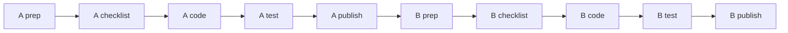
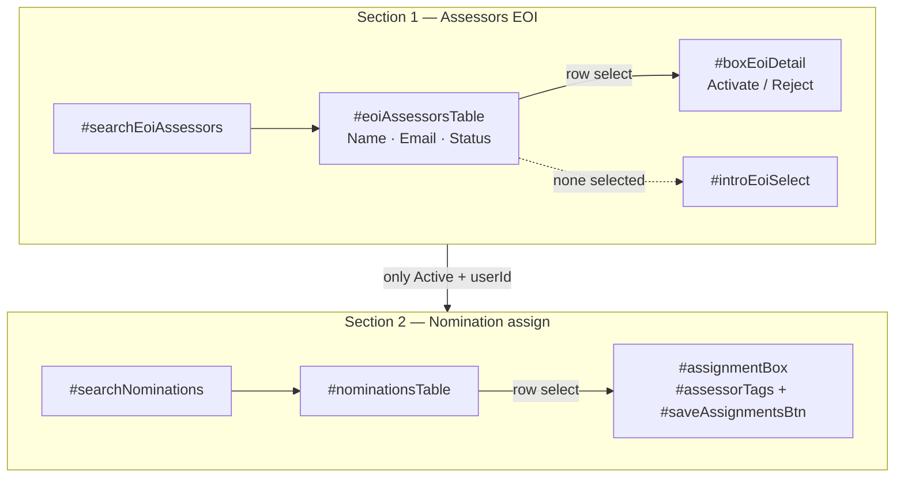
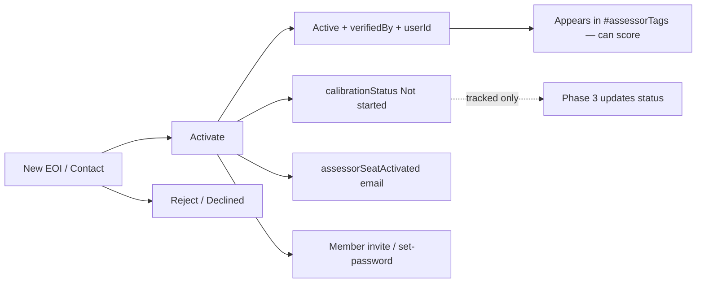

# Phase 2 — Assessor portal + Admin (kill coach)

**Gate:** One Assessor member portal (no coach); Admin verifies/activates EOI assessors and assigns assessors only.  
**Back:** [Guide](../Assessor-EOI-Wix-Plan.md) · **After:** [phase 1](01-eoi-landing.md) live · **Email catalogue:** [04](04-emails.md)

DR-002: no Nominee Coach. Do **not** copy code onto empty `Assessor Dashboard.d94bg.js`. Working UI is **Coach Dashboard** (`Coach Dashboard.b7c5p.js`).

Leave CMS `coachAssignedId` in place; **stop writing it**.

---

## How to use this file (order)

Finish **Page A** completely (including publish or a clean Local Editor gate) before starting **Page B**.  
On each page: do not ask Cursor for code until that page's **pre-code checklist** is fully ticked.


| Page  | What                                         | Order                                                      |
| ----- | -------------------------------------------- | ---------------------------------------------------------- |
| **A** | Assessor portal (redo Coach Dashboard)       | Prep → emails (if any) → checklist → code → test → publish |
| **B** | Admin Dashboard (no coach + verify/activate) | Same pattern                                               |





---


# Page A — Assessor portal

**Goal:** Members with Assessor role open one dashboard: assigned nominations, read-only packet, score/submit. No coach UI anywhere on this path.

**Page file (after Sync):** still `src/pages/Coach Dashboard.b7c5p.js` until/unless Wix renames the file on Sync — do not rename the `.js` in git by hand first.

---


## A1 — Prep (Local Editor + related pages)

Do this in Local Editor (`npm run dev`). Sync when the UI is right.

### A1.1 Portal page (Coach Dashboard → Assessor Dashboard)

1. Open **Coach Dashboard**.
2. Rename page title to **Assessor Dashboard** (editor rename only).
3. **Hide or delete** coach UI:
  - `#boxCoachView`, `#coachTable`, `#searchCoach`
  - Coach Diary tab and `#coachDiaryRichText`, `#saveDiaryBtn`, `#cbCOI`, `#dropdownCategory`
4. **Keep:**
  - `#assessorTable`, `#searchAssessor`
  - Nomination tabs: packet + customers + assessment
  - `#boxAssessmentContent`, scoring sliders, draft/submit
5. Check mobile layout for the assessor table + assessment panel.
6. **Sync** design into `ittdspace`.


### A1.2 Empty Assessor Dashboard page

- Unpublish (or remove from menus) the empty **Assessor Dashboard** page so there is only **one** portal URL.


### A1.3 Homepage

- Relabel `#btnCoach` to **Assessor** (button text in Local Editor).
- Note for Cursor: show this button **only** for Assessor role (code change in Step A4).


### A1.4 Nominee Dashboard

- Hide or delete `#coachText` / any "your coach" label in Local Editor if present.
- Cursor will also strip `coachNameDisplay` in code.


### A1.5 CMS

- **No new CMS fields** for Page A.
- Confirm `Nominations.assessors[]` and live assessment storage still work as today.
- Do **not** delete `coachAssignedId`.


### A1.6 Emails for Page A

- **No new Triggered Emails** required to ship the portal strip.
- Assignment emails **C1–C5** wait until Admin can assign (Page B) and you are ready to wire them — not a Page A gate.
- **B1** (set-password) is the native **Wix member invite**, not a Triggered Email you design here.

---


## A2 — Pre-code checklist (Page A gate)

Tick all before asking Cursor for Page A code.

- [x] Coach Dashboard renamed to Assessor Dashboard in Local Editor
- [x] Coach table / diary / coach-only controls hidden or deleted
- [x] Assessor table + packet + customers + assessment still visible
- [x] Empty Assessor Dashboard unpublished / not linked
- [x] Homepage button label says Assessor
- [x] Nominee "your coach" UI hidden or noted for code
- [x] Local Editor **Synced** to `ittdspace`
- [x] Mobile check on portal page done

**When all ticked:** ask Cursor to implement **Step A3**.

---


## A3 — Code (Cursor; only after A2)

Strip coach; keep assessor scoring.


| File                                                             | Change                                                                                        |
| ---------------------------------------------------------------- | --------------------------------------------------------------------------------------------- |
| `pages/Coach Dashboard.b7c5p.js`                                 | Assessor-only; drop coach table, diary, `currentRoleView === 'COACH'`                         |
| `backend/coach.web.js`                                           | Keep `getAssessorNominations` + customer fetch; delete diary / coach COI / coach-gated rollup |
| `public/coachDiaryPanel.js`, `public/diaryTemplate.js`           | Delete                                                                                        |
| `pages/Contractor Of The Year Award.z9t1g.js`                    | `#btnCoach` only for Assessor                                                                 |
| `pages/Nominee Dashboard.myj3i.js` + `backend/nomination.web.js` | Remove coach display                                                                          |
| `backend/multiRole.web.js`                                       | Drop `Coaches` query and `"Nominee Coach"`                                                    |
| `public/cycleConfig.js`                                          | Remove `'Nominee Coach'` from `STAFF_ROLES`                                                   |


Optional later rename: `coach.web.js` → `assessor.web.js` (can be a follow-up commit).

Do **not** rebuild the assessment form. Do **not** implement Admin EOI queue here (that is Page B).

---


## A4 — Verify and test (Page A)


### A4.1 Smoke

- [x] Portal loads for a test Assessor member without console errors
- [x] No coach table / diary visible
- [x] Homepage shows Assessor (not Coach) for Assessor role; hidden for pure nominees
- [x] Nominee dashboard has no "your coach"


### A4.2 Scenarios


| #             | Scenario                  | Steps                                                | Pass when                                                  |
| ------------- | ------------------------- | ---------------------------------------------------- | ---------------------------------------------------------- |
| A-T1 - Passed | Assessor sees assignments | Log in as test assessor with ≥1 nom in `assessors[]` | Rows in `#assessorTable`                                   |
| A-T2 - Passed | Packet read-only          | Open a nomination                                    | Packet + customers visible; no nominee edit controls       |
| A-T3 - Passed | Draft + submit            | Score, save draft, submit                            | Draft persists; submit locks as today                      |
| A-T4 - Passed | No coach path             | Attempt any former coach-only control                | Gone or inert                                              |
| A-T5 - Passed | Role gate                 | Log in without Assessor role                         | No Assessor homepage button / no portal access as designed |
| A-T6          | Desktop-only gate         | Open any dashboard on phone/tablet                   | Redirects to `/DesktopOnly`                                |


### A4.3 Failures


| Symptom               | Check                                                                        |
| --------------------- | ---------------------------------------------------------------------------- |
| Empty table           | `userId` on Assessors vs `Nominations.assessors[]`; `getAssessorNominations` |
| Coach UI still shows  | Local Editor leftover elements; page code still toggling COACH               |
| Wrong homepage button | `multiRole` / `Contractor Of The Year Award` role checks                     |


---


## A5 — Publish (Page A)

- [ ] A4 scenarios passed
- [ ] Commit + push `main` in `ittdspace/`
- [ ] Publish (CLI or Local Editor — one source)
- [ ] Live smoke: test assessor login on production

**Page A done when:** Live Assessor portal works; coach UI/role not shown to members on this path.

---


# Page B — Admin Dashboard

**Goal:** Admin has **two sections only**: (1) Assessors EOI master–detail — Activate (verifier + member invite) or Reject; (2) Nomination assignment — assign **Active** assessors only (no coach).

The old **Role assignment** block (member search → Add Coach / Add Assessor → staff tables) is **removed**. Assessors enter via Phase 1 EOI; Admin activates them here (creates/links member + stores verifier) before they can be assigned to nominations.

**Page file:** `src/pages/Admin Dashboard.nufxl.js` (confirm name after Sync).

---


## B1 — Prep (Local Editor + CMS + emails)


### B1.1 Screen model (two sections)

```
┌──────────────────────────────────────────────────────────────────────────┐
│ ADMIN DASHBOARD                                                          │
├──────────────────────────────────────────────────────────────────────────┤
│                                                                          │
│ ═══ 1. ASSESSORS (EOI pipeline) ═══════════════════════════════════════ │
│                                                                          │
│  ┌─ LIST ──────────────────┐  ┌─ DETAIL #boxEoiDetail ────────────────┐ │
│  │ #searchEoiAssessors     │  │ (collapsed until row selected)        │ │
│  │                         │  │                                      │ │
│  │ #eoiAssessorsTable      │  │ #textEoiGivenName  #textEoiFamilyName│ │
│  │  Name | Email | Status  │  │ #textEoiEmail                        │ │
│  │                         │  │ #btnEoiLinkedin                      │ │
│  │ #introEoiSelect         │  │                                      │ │
│  │ “Select an applicant”   │  │ Credentials (read-only)              │ │
│  │ (when nothing selected) │  │  #cbEoiPmp  #cbEoiPbp (disabled)     │ │
│  └─────────────────────────┘  │  #textPBPCredentialNumber            │ │
│                               │  #btnEoiCredly  #textEoiPmiId        │ │
│                               │                                      │ │
│                               │ Seat                                 │ │
│                               │  #textEoiStatus                      │ │
│                               │  #textEoiCalibrationStatus           │ │
│                               │                                      │ │
│                               │  #btnEoiActivate  #btnEoiReject      │ │
│                               └──────────────────────────────────────┘ │
│                                                                          │
│ ═══ 2. NOMINATION ASSIGNMENTS ═════════════════════════════════════════ │
│                                                                          │
│  #searchNominations                                                      │
│  #nominationsTable                                                       │
│                                                                          │
│  #assignmentBox (collapsed until nomination row selected)                │
│    #detailProjectName  #detailCompany  #detailNominee                    │
│    #assessorTags          ← options = Active assessors with userId only  │
│    #saveAssignmentsBtn                                                   │
│    (NO #coachDropdown)                                                   │
│                                                                          │
│  (KPIs / custom elements below can stay as they are)                     │
└──────────────────────────────────────────────────────────────────────────┘
```




**Product rule:** **Activate** does seat intake: credential accepted → `verifiedBy` + `Active` → create/link site member (`userId`) → `calibrationStatus = Not started` (if empty) → send activation email. **Calibration is tracked only** (`#textEoiCalibrationStatus`) — it does **not** block assignment or scoring. Section 2 `#assessorTags` = `Active` + `userId`. **Reject** ends the pipeline (`Declined`). No Waitlist on this screen.

### B1.2 Remove old Role + coach UI

Delete or hide in Local Editor:


| Remove                    | IDs                                                                            |
| ------------------------- | ------------------------------------------------------------------------------ |
| Coach staff               | `#addCoachBtn`, `#searchCoaches`, `#coachesTable`, `#deleteCoachBtn`           |
| Coach on assignments      | `#coachDropdown` (+ any coach labels)                                          |
| Old Role → Assessor staff | `#assessorsTable`, `#searchAssessors`, `#addAssessorBtn`, `#deleteAssessorBtn` |
| Old member → role triad   | `#memberSearchInput`, `#searchMembersBtn`, `#memberSearchResultsTable`         |


**Keep for Section 2:** `#searchNominations`, `#nominationsTable`, `#assignmentBox`, `#detailProjectName`, `#detailCompany`, `#detailNominee`, `#assessorTags`, `#saveAssignmentsBtn`.

### B1.3 CMS

- **No new collection.** Reuse `Assessors` from Phase 1.
- Confirm fields exist: `pipelineStatus`, `verifiedBy`, `userId`, evidence fields (`givenName`, `familyName`, `linkedin`, `credentialPmp`, `credentialPbp`, `pbpCandidateNumber`, `credlyBadgeUrl`, `pmiId`, `title_fld`, `email`).
- **Add now (if missing) for Page B UI + Phase 3:** `calibrationStatus` (text) — values: `Not started` / `In progress` / `Passed` / `Failed` (same as [03-calibration.md](03-calibration.md)).
- Optional later (Phase 3): `calibrationMode`, `calibrationAt`, `calibrationScores`, `theoryStatus`.
- `pipelineStatus` on this screen: `New` / `Active` / `Declined` (`Waitlist` may remain unused).
- Do **not** delete `coachAssignedId` or `Coaches` collection mid-cycle (code stops using them).


### B1.4 Section 1 — EOI master–detail (build in Editor)

On load / no selection: show `#introEoiSelect`, collapse `#boxEoiDetail`.  
On row select: collapse intro, expand detail, fill fields, enable action buttons.  
Evidence is **read-only** — Admin reviews offline; does not edit EOI fields here.

#### Locked element IDs — list


| Control      | ID                    | Notes                                                                                                                                             |
| ------------ | --------------------- | ------------------------------------------------------------------------------------------------------------------------------------------------- |
| Search       | `#searchEoiAssessors` | Filter name / email / status                                                                                                                      |
| Table        | `#eoiAssessorsTable`  | Manage Table field keys (must match CMS / row objects): **Name** → `title_fld`, **Email** → `email`, **Status** → `pipelineStatus` (not `status`) |
| Empty prompt | `#introEoiSelect`     | e.g. “Select an applicant in the list”                                                                                                            |


#### Locked element IDs — detail


| Control               | ID                          | CMS / notes                                                                 |
| --------------------- | --------------------------- | --------------------------------------------------------------------------- |
| Detail box            | `#boxEoiDetail`             | Collapsed until row selected                                                |
| Given name            | `#textEoiGivenName`         | `givenName`                                                                 |
| Family name           | `#textEoiFamilyName`        | `familyName`                                                                |
| Email                 | `#textEoiEmail`             | `email`                                                                     |
| LinkedIn              | `#btnEoiLinkedin`           | Button; `.link` = `linkedin`                                                |
| PMP                   | `#cbEoiPmp`                 | Disabled checkbox; `credentialPmp`                                          |
| PBP                   | `#cbEoiPbp`                 | Disabled checkbox; `credentialPbp`                                          |
| PBP Credential Number | `#textPBPCredentialNumber`  | `pbpCandidateNumber`                                                        |
| Credly                | `#btnEoiCredly`             | Button; `.link` = `credlyBadgeUrl`                                          |
| PMI ID                | `#textEoiPmiId`             | `pmiId`                                                                     |
| Status                | `#textEoiStatus`            | Read-only `pipelineStatus` (New / Active / Declined)                        |
| Calibration           | `#textEoiCalibrationStatus` | Read-only `calibrationStatus` (Not started / In progress / Passed / Failed) |
| Activate              | `#btnEoiActivate`           | Active + verifier + member create/link + calibration Not started + email    |
| Reject                | `#btnEoiReject`             | `pipelineStatus=Declined` + decline email                                   |


**Not on this screen:** `#textEoiTitle`, `#textEoiUserId`, `#textEoiVerifiedBy`, `#textEoiAdminStatus`, `#btnEoiMakeMember`, Waitlist.

#### Seat / calibration display


| ID                          | CMS                 | Purpose                                                                                        |
| --------------------------- | ------------------- | ---------------------------------------------------------------------------------------------- |
| `#textEoiStatus`            | `pipelineStatus`    | Seat intake: New vs Active vs Declined                                                         |
| `#textEoiCalibrationStatus` | `calibrationStatus` | Tracking only (Not started → … → Passed/Failed). Does **not** gate scoring or `#assessorTags`. |


`userId` and `verifiedBy` stay in **CMS** (set on Activate) but are **not** shown on the Admin UI. Errors / success use the **Alert** lightbox.

#### Two actions (product)


| Button                         | Does                                                                                                                                                                                                                                                                                                                         |
| ------------------------------ | ---------------------------------------------------------------------------------------------------------------------------------------------------------------------------------------------------------------------------------------------------------------------------------------------------------------------------- |
| **Activate** `#btnEoiActivate` | Credential OK. Set `pipelineStatus=Active`, `verifiedBy` = logged-in admin display name. Find-or-create **site member** for row `email`, set `userId`. Set `calibrationStatus = Not started` if empty. Send `assessorSeatActivated` (activated + invite/set-password; calibration available later but optional for scoring). |
| **Reject** `#btnEoiReject`     | Set `pipelineStatus=Declined`; send `assessorSeatDeclined`. Do **not** create a member.                                                                                                                                                                                                                                      |





#### Activate — member create/link (inside the same click)

Phase 1 created a **Contact**. Activate turns them into (or links) a **Member**:

1. Look up member by `loginEmail` = row `email`. If found → set `userId`.
2. If not found → register/invite via Members backend (e.g. register + `sendSetPasswordEmail`) → set `userId`.
3. Persist Active + `verifiedBy`; set `calibrationStatus = Not started` if empty; then send `assessorSeatActivated` (activation + invite/set-password; mention calibration as recommended tracking, not a scoring lock).
4. Fallback: if invite API fails, still set Active + `verifiedBy` if desired, and show an **Alert** telling Admin to finish invite in **Wix Dashboard → Members**, then re-open the row to confirm `userId` linked (or a small “Refresh member link” later — not required for B1).


### B1.5 Emails (create before Page B code)

Use **Developer Tools → Triggered Emails** (same as Phase 1: **+ Add Variable**, not Contact-only Personalize).


| Email ID (lock)         | When                  | Audience  | Subject                                       |
| ----------------------- | --------------------- | --------- | --------------------------------------------- |
| `assessorSeatActivated` | Admin clicks Activate | Applicant | You are activated as a PCotY Stage 1 assessor |
| `assessorSeatDeclined`  | Admin clicks Reject   | Applicant | PCotY assessor application — not this cycle   |


**Waitlist** email = deferred. **C1–C5** = after assign path works.

**Fallbacks:** `givenName` → `there`; `SITE_URL` → `https://www.ittd.space` (or your live award URL).

Write Email IDs here if Wix assigns UUIDs instead: __________________

#### `assessorSeatActivated`

**Variables:** `givenName`, `familyName`, `SITE_URL`

**Must say:** activated; separate Wix invite / set-password may follow; how to log in; Assessor portal; calibration may come later but is not a blocker to scoring; plain ASCII.

```
Hi {{givenName}},

You have been activated as a Stage 1 assessor for the Project Contractor of the Year Award.

If you do not already have a login for our site, you will receive a separate Wix email to set your password or accept the member invitation. Use that email first, then sign in.

After you can log in, open the Assessor dashboard from the award site to see nominations assigned to you and submit scores when scoring is open.

We may also ask you to complete a short calibration exercise so the panel marks to a shared standard. That helps consistency. It is tracked for the programme; it does not block you from scoring once you are assigned.

If the invite email does not arrive within a day, check spam or contact the organisers.

PCotY organisers
{{SITE_URL}}
```


#### `assessorSeatDeclined`

**Variables:** `givenName`, `familyName`, `SITE_URL`

**Must say:** not this cycle; thank you; no false hope; plain ASCII.

```
Hi {{givenName}},

Thank you for applying to be a Stage 1 assessor for the Project Contractor of the Year Award.

We will not be offering you an assessor seat for this cycle. This is not a judgement of your overall experience. Seats are limited and we have to balance the panel for the nominations we expect.

We appreciate the time you took to apply.

PCotY organisers
{{SITE_URL}}
```


### B1.6 Sync

Local Editor **Sync** after: old Role/coach UI removed, Section 1 EOI elements exist (IDs above), Section 2 kept without `#coachDropdown`.

---


## B2 — Pre-code checklist (Page B gate)

- [x] Old Role + coach UI removed (IDs in B1.2)
- [x] Section 1 EOI master–detail built with locked IDs (B1.4) — Activate / Reject only
- [x] Section 2 nomination assign kept; `#coachDropdown` gone; `#assessorTags` ready
- [x] `Assessors` CMS: evidence + pipeline fields; `calibrationStatus` **added** (Not started / In progress / Passed / Failed)
- [x] Section 1 shows `#textEoiStatus` and `#textEoiCalibrationStatus`
- [x] Two Triggered Emails created (`assessorSeatActivated`, `assessorSeatDeclined`); IDs match or UUIDs noted
- [x] Local Editor **Synced**

**When all ticked:** ask Cursor to implement **Step B3**.

---


## B3 — Code (Cursor; only after B2)


### B3.1 Kill coach + old Role admin


| File                                                        | Change                                                                                            |
| ----------------------------------------------------------- | ------------------------------------------------------------------------------------------------- |
| `public/roleAdmin.js` + `backend/admin.web.js`              | Remove or replace: Coaches + old Add Assessor staff path; EOI pipeline owns Assessors             |
| `public/assignmentsAdmin.js` + `backend/assignments.web.js` | No coach dropdown / no `coachAssignedId` writes; `#assessorTags` options = Active + `userId` only |
| `backend/dashboard.web.js` + assignment custom element      | Drop coach workload / `needsCoachAssigned`                                                        |


### B3.2 EOI pipeline (Section 1)


| Piece                                                        | Behaviour                                                                            |
| ------------------------------------------------------------ | ------------------------------------------------------------------------------------ |
| `backend/assessorPipeline.web.js` (or extend `admin.web.js`) | `listEoiAssessors`, `activateAssessor` (member + verifier + email), `rejectAssessor` |
| Admin page + `public/assessorPipelineAdmin.js` (new)         | Master–detail; Activate / Reject; no duplicate rows                                  |


- **Activate:** `pipelineStatus=Active`, `verifiedBy` = current admin, find-or-create member + set `userId`, set `calibrationStatus=Not started` if empty, send `assessorSeatActivated`.
- **Reject:** `pipelineStatus=Declined`, send `assessorSeatDeclined` (no member create).  
- After Activate: refresh assignable assessor options for Section 2.

---


## B4 — Verify and test (Page B)


### B4.1 Smoke

- [ ] Admin loads; no coach / old Role controls
- [ ] Section 1 EOI master–detail lists applicants; detail shows evidence (`#cbEoiPmp` / `#cbEoiPbp` / `#btnEoiLinkedin` / `#textPBPCredentialNumber`)
- [ ] Section 2 has no `#coachDropdown`; `#assessorTags` only Active + `userId`


### B4.2 Scenarios


| #    | Scenario                   | Steps                                   | Pass when                                                                                         |
| ---- | -------------------------- | --------------------------------------- | ------------------------------------------------------------------------------------------------- |
| B-T1 | List EOI                   | Open Admin pipeline                     | Rows with New + evidence in detail                                                                |
| B-T2 | Activate (existing member) | Activate email that already has a login | Active; `verifiedBy` set; `userId` linked; `calibrationStatus=Not started`; activation email sent |
| B-T3 | Activate (new member)      | Activate email with no login yet        | Same + member invite/set-password; email explains invite; calibration tracked Not started         |
| B-T4 | Reject                     | Click Reject                            | Declined; decline email; no member created                                                        |
| B-T5 | Assign Active only         | Assign nomination; confirm tags         | Only Active+userId; no coach write to `coachAssignedId`                                           |


### B4.3 Failures


| Symptom                 | Check                                                                               |
| ----------------------- | ----------------------------------------------------------------------------------- |
| Empty EOI table         | Collection permissions; field keys; query                                           |
| Email not sent          | Triggered Email ID; contact created; template published                             |
| Duplicate Assessors row | Activate must update by `_id` / email, not blind insert                             |
| Member invite failed    | Alert lightbox; Dashboard Members fallback; retry / re-open row to confirm `userId` |


---


## B5 — Publish (Page B)

- [ ] B4 scenarios passed
- [ ] Commit + push `main`
- [ ] Publish
- [ ] Live smoke: Activate one test EOI on production (member + email)

**Page B done when:** Admin can Activate (verifier + member + email) or Reject; no coach assignment anywhere.

---


## Phase 2 done when

Page A and Page B both published. Empty assessor page unpublished. Coach role not shown to members. Admin owns verify/activate and assessor-only assign.

**Deferred (same programme, later):** C1–C5 assignment emails; full COI lightbox enforcement if not already solid; Phase 3 calibration tracking (exam/status) — does not gate scoring or assignment.