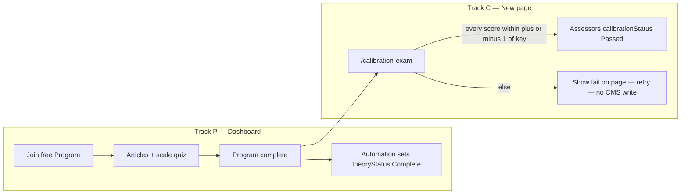
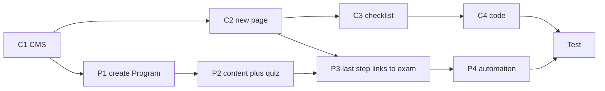

# Phase 3 — Calibration (theory then exam)

**Gate:** A test member can finish theory + exam and show `calibrationStatus = Passed` on Admin.  
**Back:** [Guide](../Assessor-EOI-Wix-Plan.md) · **Needs:** [phase 2](02-assessor-portal.md) portal · **Emails:** [04](04-emails.md) B2–B4  
**When:** late Oct, before Stage 1 (Nov–Dec). Not 15 Aug.

**Product rule (Phase 2):** Calibration is **tracked** (`Assessors.calibrationStatus`, shown on Admin). It does **not** block assignment or scoring. Admin may assign when `pipelineStatus = Active` and `userId` is set, even if calibration is `Not started`.

Two different Wix products. Do not mix them.


| Track          | What it is                                                   | Where you build it                   | Code?                                             |
| -------------- | ------------------------------------------------------------ | ------------------------------------ | ------------------------------------------------- |
| **P — Theory** | A Wix **Online Program** (articles + quiz)                   | Site **Dashboard → Online Programs** | No page code. One **Automation** after it exists. |
| **C — Exam**   | A **new site page** that duplicates the live assessment form | **Local Editor** (`npm run dev`)     | Cursor, only after the page exists and is Synced  |


Wix Programs **cannot** host the 9-criteria packet. That is why the exam is a normal site page.




**Tracking rule:** CMS only stores **done or not** on `Assessors` (`calibrationStatus = Not started` / `Passed`). No attempt history, no draft rows, no score dump. Fail is page-only; they retry until they pass.

---


## How to use this file (order)

You have never needed a Program until now. Track P is **not** a page you draw in Local Editor. Track C **is**.

Finish **C1 + C2** (CMS + new page) and **Sync** before asking Cursor for exam code.  
You can build the Program (P1–P3) in parallel — it does not wait on Cursor. Finish the last Program step once the exam URL exists.


| Step      | What                                                         | Who                               |
| --------- | ------------------------------------------------------------ | --------------------------------- |
| **C1**    | CMS fields on `Assessors` only; packet + key as JSON in repo | You (CMS + edit JSON + file URLs) |
| **C2**    | Create **Calibration Exam** page in Local Editor, then Sync  | You                               |
| **C3**    | Pre-code checklist                                           | You                               |
| **C4**    | Cursor writes exam page + backend                            | Cursor (after C3)                 |
| **P1–P3** | Create the Program, content, quiz, last-step link            | You (Dashboard)                   |
| **P4**    | Automation: program complete → `theoryStatus`                | You (Dashboard); Cursor snippet   |
| **T**     | Test                                                         | You                               |
| **E**     | Emails B2/B4 (B3 deferred)                                   | After URLs exist; not a code gate |





Do **not** ask Cursor for code until **C3** is fully ticked. You cannot create or rename the exam page from Cursor — Wix ignores a file you invent in git.

---


## What already exists on the site (do not recreate)

The Programs **app** is already on ittd.space. You already have native pages:

- `Program List.m8nc6.js` — catalogue of programs
- `Participant Page.n0xai.js` — a member’s view inside a program

Leave those alone. Do not put **Program List** in the public site menu. Assessors will use a **direct Program URL** (and later an email), not a shopfront.

Working live assessment UI (to duplicate): **Assessor Dashboard** (`Assessor Dashboard .b7c5p.js`). Element IDs on that page are the ones the exam must reuse.

---


# Track C — Calibration Exam page

**Goal:** A logged-in assessor opens the Calibration Exam page (public nav link OK), sees **one** sample row in the same table UI as Assessor Dashboard, selects it, scores with the **same sliders**, and on Submit gets Pass / Fail in an **Alert** against the JSON key. On pass only, set `Assessors.calibrationStatus = Passed`. Nothing writes to live `Assessments`, `Nominations`, or `Customer_Feedback`.

**Slug (lock):** `/calibration-exam`  
**Page name (lock):** `Calibration Exam`

---


## C1 — CMS (do this first)

Dashboard → **CMS** (Content Manager). No datasets on the exam page — same as live scoring.

### C1.1 Fields on `Assessors`

`calibrationStatus` should already exist from Page B. **Phase 3 uses only two values:** `Not started` / `Passed`. Ignore any older `In progress` / `Failed` wording on Page B — we do not persist those.

Add the rest if missing:


| Key                 | Type | Values / purpose              |
| ------------------- | ---- | ----------------------------- |
| `theoryStatus`      | text | `Not started` / `Complete`    |
| `calibrationStatus` | text | `Not started` / `Passed` only |
| `calibrationAt`     | date | When they passed the exam     |


**Do not add** `calibrationMode` (always online), `calibrationScores`, a `CalibrationAttempts` collection, a `CalibrationKey` collection, or a sample row in `Nominations` / `Customer_Feedback`. The packet + answer sheet are **one JSON file in git**. Putting a fake nomination in CMS would skew Admin KPIs.

Default for a newly Activated assessor: `theoryStatus = Not started`, `calibrationStatus = Not started` (Page B already sets calibration if empty).

### C1.2 Packet + key (JSON — not Nominations CMS)

Single file:

[calibration-packet/calibration-packet.json](calibration-packet/calibration-packet.json)

Guide: [calibration-packet/json-field-guide.md](calibration-packet/json-field-guide.md) · choice rationale: [calibration-packet/README.md](calibration-packet/README.md)

On C4, Cursor copies it to `ittdspace/src/backend/calibration-packet.json`. Backend **imports it on the server only**. Do not put it under `public/`.


| JSON path                   | Purpose                                                                                                                                             |
| --------------------------- | --------------------------------------------------------------------------------------------------------------------------------------------------- |
| `packet.*`                  | Same shape as Assessor Dashboard nomination fields (`title`, `company`, `exemplary`, `impact`, `lessons`, checkboxes, …)                            |
| `packet.mainNarrative`      | URL — **filled** ([narrative PDF](https://dba55502-391b-4832-9190-b7e92d29aae0.usrfiles.com/ugd/dba555_ffdc258082624b7e8937a82a51d8d270.pdf))       |
| `packet.fileContractMatrix` | URL — **filled** ([contract matrix PDF](https://dba55502-391b-4832-9190-b7e92d29aae0.usrfiles.com/ugd/dba555_838b4da011494a909e9e5399117ebd8a.pdf)) |
| `packet.fileRaci`           | URL — **filled** ([RACI PDF](https://dba55502-391b-4832-9190-b7e92d29aae0.usrfiles.com/ugd/dba555_9409b8c0e1f34031a57e49126ba4ded9.pdf))            |
| `packet.customers[]`        | Customer cards for the Customers tab (from JSON, not `Customer_Feedback`)                                                                           |
| `passTolerance`             | `2` (±2 inclusive on the 1-10 scale)                                                                                                                |
| `key.*`                     | The 9 reference scores (1–10)                                                                                                                       |


**Pass rule (lock):** every one of the 9 scores is within **±2** of the key (inclusive). Same relative band as the old ±1 on a 0-5 scale.

**Your upload steps** — done when the three URLs are in [calibration-packet.json](calibration-packet/calibration-packet.json).

Selected narrative: Supply Chain / QuickShip (Confluence [149159942](https://ittd.atlassian.net/wiki/spaces/PBF/pages/149159942)). Healthcare and BESS stay as alternates only.

For a first wiring test you may set every `key` score to `6` if Angel/Peter have not locked the key yet.

---


## C2 — New page (Local Editor)

You cannot do this in Cursor. `cd ittdspace && npm run dev`, then work in the Local Editor.

### C2.1 Duplicate Assessor Dashboard (do not start from a blank page)

The exam must use the **same element IDs** as live scoring (`#sliderprojectSuccessScore`, `#cbAsessmentCOI`, …). A blank page will not have them. Copy-pasting widgets one-by-one often produces IDs like `sliderprojectSuccessScore1` — that breaks the panel.

1. Pages panel → **Assessor Dashboard**.
2. Duplicate the page (⋯ menu → **Duplicate**).
3. Rename the duplicate to **Calibration Exam** (page name only; do not rename `.js` files in git).
4. Page settings:
  - **Slug:** `calibration-exam` → URL `/calibration-exam`
  - **Permissions:** Members only (must be logged in)
  - **SEO:** noindex if the option exists
5. **Add a public nav link** to this page (site menu / header — same places you put Assessor). You can hide it from a menu later yourself if needed; do **not** leave the page unreachable except via email. Program last step and emails still use `/calibration-exam` as well.
6. Keep the **desktop-only** behaviour in mind (code will reuse `redirectIfNotDesktop`). Check the layout at desktop width; this page is not a phone UI.

After **Sync**, git will grow a new file such as `src/pages/Calibration Exam.xxxxx.js`. That stub will still contain a copy of the dashboard code — leave it. Cursor replaces it in C4.

### C2.2 Keep the Assessor Dashboard behaviour (do not strip the UI)

**Product rule:** Mimic the live Assessor portal as closely as possible. Same table → select → packet tabs → score → buttons. Differences are only in **data source** (JSON, one row) and **what Submit does** (compare to key + **Alert** popup, not write live `Assessments`).

**Keep everything from the duplicate**, including:


| Keep           | IDs                                                                |
| -------------- | ------------------------------------------------------------------ |
| List + search  | `#assessorTable`, `#searchAssessor`                                |
| Select prompt  | `#introBox`                                                        |
| Detail         | `#nominationTabs` and all packet / customers / assessment controls |
| Scoring        | All live slider + justification IDs (table below)                  |
| Draft + Submit | `#btnAsessmentSaveDraft`, `#assessmentSubmitButton`                |


**Do not hide** the table or search in the Editor. At runtime, code fills `#assessorTable` with **exactly one row** (the calibration packet from JSON). The member uses search/select the same way as on Assessor Dashboard.

**Scoring IDs must stay exactly these** (fix Properties if the duplicate renamed any):


| Role            | ID                                                                                                                                                                                                                                                                                                                                                                                     |
| --------------- | -------------------------------------------------------------------------------------------------------------------------------------------------------------------------------------------------------------------------------------------------------------------------------------------------------------------------------------------------------------------------------------- |
| Assessment wrap | `#boxAssessmentContent`                                                                                                                                                                                                                                                                                                                                                                |
| No COI          | `#cbAsessmentCOI`                                                                                                                                                                                                                                                                                                                                                                      |
| Draft           | `#btnAsessmentSaveDraft`                                                                                                                                                                                                                                                                                                                                                               |
| Submit          | `#assessmentSubmitButton`                                                                                                                                                                                                                                                                                                                                                              |
| Sliders         | `#sliderprojectSuccessScore`, `#slideragilityAdaptabilityScore`, `#slidercommercialModelScore`, `#sliderlegalSoundnessScore`, `#sliderinterfaceGovernanceScore`, `#sliderriskManagementScore`, `#sliderpeopleDevelopmentScore`, `#sliderteamBusinessAcumenScore`, `#sliderinnovationAdvancementScore`                                                                                  |
| Justifications  | `#textBoxprojectSuccessJustification`, `#textBoxagilityAdaptabilityJustification`, `#textBoxcommercialModelJustification`, `#textBoxlegalSoundnessJustification`, `#textBoxinterfaceGovernanceJustification`, `#textBoxriskManagementJustification`, `#textBoxpeopleDevelopmentJustification`, `#textBoxteamBusinessAcumenJustification`, `#textBoxinnovationAdvancementJustification` |


Spelling of `#cbAsessmentCOI` and `#btnAsessmentSaveDraft` is the live typo — **keep it**.

Optional (same as portal): code may still collapse leftover nominee-only upload/delete controls at runtime; leave them in the Editor.

**Submit / Draft behaviour (C4 — no new result box on the page):**

- **Submit** → calibration backend → open the existing **Alert** lightbox with pass/fail and theirs vs key (same Alert pattern as live assessment errors). On fail they stay unlocked and can change scores and submit again. On pass, lock like live `SUBMITTED`.
- **Draft** → keep the button; calibration does not persist drafts (Alert: short message that draft is not saved for calibration, or inert). Prefer keeping the control so the page feels identical.


### C2.3 New elements (exam-only)

Add only the theory gate (and a short intro). **Do not** add an on-page result box — results use **Alert**.


| Control        | Element | ID                   | Notes                                                             |
| -------------- | ------- | -------------------- | ----------------------------------------------------------------- |
| Intro          | Text    | `#textCalibIntro`    | See copy below. Above the table is fine.                          |
| Theory gate    | Box     | `#boxTheoryBlocked`  | Shown if `theoryStatus` is not `Complete`. Start collapsed.       |
| Theory message | Text    | `#textTheoryBlocked` |                                                                   |
| Go to Program  | Button  | `#btnGoToProgram`    | Link set in code (or Editor) to the Program URL once you have it. |


**Do not add:** `#boxExamResult`, `#textExamResult`, `#btnRetryExam`.

**Intro copy (plain ASCII):**

```
This is a calibration exercise, not a live nomination. Select the sample row below, score all nine criteria (1-10), and write a justification for each. You pass if every score is within 2 points of the reference key. Submit shows your result. You can retry if you do not pass.
```

**Theory-blocked copy:**

```
Finish the assessor theory program first (including the short quiz). Then come back here for the calibration exam.
```

Button label: `Open theory program`

### C2.4 Screen model

```
┌──────────────────────────────────────────────────────────────────────────┐
│ CALIBRATION EXAM                     members only · public nav link OK   │
│ #textCalibIntro                                                          │
├──────────────────────────────────────────────────────────────────────────┤
│ #boxTheoryBlocked   (only if theoryStatus ≠ Complete)                    │
│   #textTheoryBlocked                                                     │
│   #btnGoToProgram                                                        │
├──────────────────────────────────────────────────────────────────────────┤
│ #searchAssessor                                                          │
│ #assessorTable   ← exactly ONE row (from JSON), select as usual          │
│ #introBox        ← until a row is selected                               │
├──────────────────────────────────────────────────────────────────────────┤
│ #nominationTabs  (same as Assessor Dashboard)                            │
│   Packet | Customers | Assessment                                        │
│                                                                          │
│   Assessment tab = #boxAssessmentContent                                 │
│     #cbAsessmentCOI                                                      │
│     9 × slider + justification  (same IDs as live)                       │
│     #btnAsessmentSaveDraft   #assessmentSubmitButton                     │
│                                                                          │
│   Submit → Alert lightbox (pass/fail + yours vs key)                     │
└──────────────────────────────────────────────────────────────────────────┘
```

Same interaction as Assessor Dashboard: select the (only) row → expand detail → score → Submit. Data and pass/fail logic come from JSON + calibration backend.

### C2.5 Sync

Local Editor → **Sync** into `ittdspace`. Confirm a new `Calibration Exam.*.js` appeared. Do not rename it in git.

---


## C3 — Pre-code checklist (exam gate)

Tick **every** box before asking Cursor to implement **C4**.

- [x] `Assessors`: `theoryStatus`, `calibrationAt` added; `calibrationStatus` already there (use `Not started` / `Passed` only) — **no** `calibrationMode`
- [x] **No** `CalibrationAttempts`, **no** `CalibrationKey` CMS, **no** sample row in `Nominations` / `Customer_Feedback`, **no** `calibrationScores` field
- [x] [calibration-packet.json](calibration-packet/calibration-packet.json) has packet text + key + **file URLs filled**
- [x] Page **Calibration Exam** exists; slug `/calibration-exam`; members only; **public nav link** added (you may hide from a menu later)
- [x] Page was **duplicated from Assessor Dashboard** (not blank)
- [x] Table + search + intro + packet + assessment **kept** (not stripped); live scoring IDs unchanged
- [x] New IDs present: `#textCalibIntro`, `#boxTheoryBlocked`, `#textTheoryBlocked`, `#btnGoToProgram`
- [x] **No** on-page result box (`#boxExamResult` / `#textExamResult` / `#btnRetryExam`) — Submit will use **Alert**
- [x] `#boxTheoryBlocked` starts collapsed
- [x] Local Editor **Synced** to `ittdspace`
- [x] Desktop layout checked

**When all ticked:** ask Cursor to implement **Step C4**.

---


## C4 — Code (Cursor; only after C3)

**Status:** implemented in `ittdspace` (2026-08-16).

Do **not** rebuild the assessment form. Reuse table + panel patterns from Assessor Dashboard; wire a **calibration** backend.


| File                                    | Change                                                                                                                                       |
| --------------------------------------- | -------------------------------------------------------------------------------------------------------------------------------------------- |
| `backend/calibration.web.js` (new)      | `getCalibrationContext`, `submitCalibration` (compare ±2 vs JSON key; on pass only patch `Assessors`); `markTheoryCompleteByEmail` for P4    |
| `backend/calibration-packet.json` (new) | Copied from [calibration-packet/calibration-packet.json](calibration-packet/calibration-packet.json); server import only                     |
| `pages/Calibration Exam.*.js`           | Desktop gate; member required; theory gate; **one-row** table from JSON; select → packet like Assessor Dashboard; Submit → Alert with result |
| `public/assessmentPanel.js`             | Calibration adapter: submit compares to key (no live `Assessments`); draft does not persist                                                  |
| `public/customerCards.js`               | `setCustomerCardsFromList` for JSON customers (no `Customer_Feedback`)                                                                       |
| `public/nominationSelectionTable.js`    | Unchanged — page feeds a single synthetic row                                                                                                |


**Backend must:**

- Load `packet` + `customers` + `key` from `calibration-packet.json` (not from `Nominations` / `Customer_Feedback`)
- Never `insert`/`update` `Assessments`, `Nominations`, or `Customer_Feedback`
- **No** `CalibrationAttempts` / **no** `CalibrationKey` CMS — do not create them
- Import the JSON only in backend code (never expose `key` as a public module before submit)
- On submit **pass** (all 9 within ±`passTolerance` of key): set `calibrationStatus = Passed`, `calibrationAt = now`
- On submit **fail**: return theirs vs key for the **Alert**; **do not** change `Assessors`; sliders stay editable for retry
- If already `Passed`, short-circuit (show passed state; do not require re-exam)
- After submit, return theirs vs key for the Alert (not before)

**Page must:**

- `redirectIfNotDesktop`
- Require login; prefer Assessor role (Admin may preview)
- Theory gate: `theoryStatus !== Complete` → expand `#boxTheoryBlocked` (optional UX — still not a scoring lock on the **portal**)
- `#btnGoToProgram` → [Program URL](https://www.ittd.space/challenge-page/2a325a22-42b1-4c3e-a785-c9d73474d734) (`PROGRAM_URL` in page code)
- Put **one** row in `#assessorTable` built from JSON `packet` (title/company/status as on Assessor Dashboard); `#searchAssessor` still works on that one row
- On row select: `renderNominationReadOnly($w, packet)` + customers from `packet.customers` (not CMS); then assessment panel as live
- **Submit** → calibration backend → `wixWindow.openLightbox("Alert", { message: … })` with pass/fail and theirs vs key
- **Draft** → keep control; do not write CMS (short Alert that calibration does not save drafts is fine)
- Do not call `assessments.web.js` / `getAssessorNominations` for live data on this page

---


# Track P — Theory (Wix Online Programs)

You do this in the **site Dashboard**, not Local Editor. Content lives in Wix, not git ([phase 0](00-git-and-cli.md)).

Official help: [Create a program](https://support.wix.com/en/article/online-programs-creating-a-new-program) · [Sections and steps](https://support.wix.com/en/article/wix-online-programs-adding-sections-and-steps-to-your-program) · [Quiz](https://support.wix.com/en/article/wix-online-programs-adding-a-quiz-or-survey) · [Price and visibility](https://support.wix.com/en/article/wix-online-programs-monetizing-your-program)

There is [no Velo API](https://support.wix.com/en/article/wix-online-programs-request-integrating-velo-api) to read progress in page code. That is why **P4 Automation** writes `theoryStatus` into CMS.

Do **not** turn on a Program **certificate**. That is not O1.

---


## P1 — Create the Program (first time)

1. Open **ittd.space Dashboard** (not Local Editor). Left sidebar → **Online Programs**. If you do not see it: **Add Apps** → search `Online Programs` → add. You should already have it (`Program List` exists).
2. **+ Create New** → **Create from scratch** (skip templates and AI).
3. **Name (lock):** `PCotY Stage 1 — Assessor theory`
4. **Pace:** **Self-paced** (not a dated schedule). Self-paced is what gives you **Sections**.
5. **Duration:** about **2 hours** (Section 2 has 10 criterion steps + quiz + exam later).
6. Create. You now have a **draft**. Nothing is public yet.


### P1.1 Settings to lock

Open the program → **Settings**.

**Basic info**

- Name as above.
- Description (plain ASCII):

```
Short theory for Stage 1 assessors: why the award exists, the 1-10 scale, the nine criteria (one Program section with 10 steps), conflict of interest, and how the portal works. Finish the quiz, then take the calibration exam on the site.
```

- Cover image: optional (award / PBF artwork if you have it).

**Enrollment and payment** (this is the “members-only, free” bit)

1. **Settings → Enrollment & payment → Edit**.
2. **Pricing:** **Free**. Not a paid plan. Not a one-time price.
3. **Visibility while you build and test:** **Public** (anyone with the URL can join — easiest).
4. **Before late-Oct live:** switch to **Secret** and share the invite/join link only with activated assessors (B2 email). Secret hides it from Program List visitors.
5. **Participant cap:** Unlimited.
6. Save.

Joining a Program requires a **site member**. Activate (Page B) already creates/links that member. They log in, open the Program URL, click Join. No payment step.

**Engagement**

- **Certificate:** off. Do not assign a Program certificate.
- **Group:** leave disconnected unless you explicitly want a Wix Group thread (not required).
- **Badges:** optional; not O1.

Write the Program URL here once Wix shows it (usually under share / invite, or the live path `/challenge-page/…`):

- Program URL: [https://www.ittd.space/challenge-page/2a325a22-42b1-4c3e-a785-c9d73474d734](https://www.ittd.space/challenge-page/2a325a22-42b1-4c3e-a785-c9d73474d734)
- Invite link (if Secret): __________________

`#btnGoToProgram` and emails use this URL. Wired in `Calibration Exam.nug0x.js` as `PROGRAM_URL`.

### P1.2 Hide the shopfront

- Do **not** add **Program List** to the public header/footer.
- Do **not** market this Program on the award homepage.
- Direct URL (+ later B2) is enough.

---


## P2 — Content (sections and steps)

Program → **Content** tab → **+ Add**.

Build **sections first**, then steps inside them. **Section dripping: off** (they can do it in one sitting).

Each **Article** is a text step. **Video** is optional — if Angel has no walkthrough recording yet, keep those steps as Articles. You can swap in a Video later without changing CMS or code.

Paste the copy below. Plain ASCII. You can polish tone later; this is enough to ship the structure.

Sources for criterion steps: [Assessment Guide](../../Guides/Contractor-of-the-Year-Assessment-Guide-2026.md) + LinkedIn draft [What makes a winning nomination](../../../Marketing/Articles/Research/What-makes-a-winning-nomination/draft.md).

**Section map (lock):**


| Section                       | Steps  | Contents                                      |
| ----------------------------- | ------ | --------------------------------------------- |
| **1 — Why and how you score** | 4      | Why · do/don't · 1-10 scale · red/green flags |
| **2 — The nine criteria**     | **10** | Glance (1) + one step per criterion (9)       |
| **3 — Conduct and exam**      | 4      | COI · quiz · portal · exam link               |


### Section 1 — Why and how you score

**Step 1.1 Article — Why PCotY exists**

```
The Project Contractor of the Year Award exists because somebody has to decide what "outstanding" means in contracted project delivery.

You will read real nominations from real contracts: the delivery story, the commercial model, the governance, and the client's own assessment.

Then you score them against nine published criteria, alongside peers who do the work you do.

This short program is not the exam. It is the shared brief so the panel marks to the same standard. After the quiz you will score one sample nomination on the calibration exam page.
```

**Step 1.2 Article — What you do / do not do**

```
You do: confirm no conflict of interest, read the packet, score nine criteria (1-10), write a justification for each, and submit by the deadline.

You do not: decide eligibility or completeness (Admin does that before assignment). You do not coach nominees. You do not share scores with nominees.

Questions go to the organisers, not to the nominee.
```

**Step 1.3 Article — What the numbers mean (1-10 scale)**

```
The Assessor Dashboard and Calibration Exam use the same sliders: minimum 1, maximum 10, step 1.

1 = Not demonstrated / missing evidence
2 = Poor
3-4 = Fair
5-6 = Good
7-8 = Very good
9-10 = Excellent

1 is not a moral judgement. It means the packet did not show it.

5-6 is solid professional work. 9-10 is exceptional and evidenced. Do not save 10 for "someone else". If the evidence is there, give it.

Nine criteria, 10 maximum each. 90 is the highest one assessor can give a nomination.

Customer evaluation is a separate 0-10 weighted form filled by the client. Do not convert customer scores into your nine scores.

If two assessors differ by more than 4 points on a criterion, the Project Manager moderates. Discuss evidence, not ego.
```

**Step 1.4 Article — Red flags and green flags**

```
Red flags: missing evidence, no measurable impact, generic approach, no knowledge sharing, integrity concerns, 0% people development.

Green flags: clear transformation, real innovation, active sharing, strong cross-party risk and integrity, 5%+ people development, case-study worthy.

Winners are not "competent delivery". Look for excellence, impact, industry contribution, innovation, and legacy.
```


### Section 2 — The nine criteria (10 steps)

**Step 2.1 Article — The nine at a glance**

```
Score every criterion. A comment is required on each.

1. Project Success (Outcomes) — Did they deliver? Lasting impact vs baseline, benefits, handover.
2. Agility and Adaptability — Change control; fit to the contracting model (including T&M).
3. Commercial Model (Liquidity) — Price realism, cash flow, supply-chain payment.
4. Legal Soundness — Law/jurisdiction, warranty/liability, privity, fit to the collaboration model.
5. Interface and Governance — Customer-contractor boundary, escalation, decision rights.
6. Risk Management (Cross-Corporate) — Risks and mitigations across the interface, not only inside one firm.
7. People Development — Investment as a share of profit, with evidence, and an effect on delivery.
8. Team and Business Acumen — Candour, initiative, leadership, integrity under pressure.
9. Innovation and Industry Advancement — The differentiator. Winners are typically 8-10 here. Would we publish this?

The next nine steps go one criterion at a time. Use them as the scoring spine, not as slogans.
```

**Step 2.2 Article — Criterion 1: Project Success (Outcomes)**

```
Ask: Did they deliver? What lasting impact?

Look for: delivery vs baseline; benefits; handover; measurable impact and transformation.

Closing a project cleanly and getting the thing the client paid for are not the same event. On-time and on-budget are necessary. A year on: is the client still getting value, or did "success" stop at the acceptance certificate?

Score from the packet evidence. Silence is not neutral. If you find nothing lasting beyond handover, say so and score accordingly.
```

**Step 2.3 Article — Criterion 2: Agility and Adaptability**

```
Ask: How did they handle change without chaos?

Look for: change control; fit to the contracting model (including T&M cash and visibility).

Change is the job. The question is not whether changes appeared. When they did, did the relationship hold, or did the parties start writing letters to each other?

For T&M: billing frequency vs contractor cash-flow needs, rate transparency, client cost visibility, and whether change control stayed compatible with the project objectives.
```

**Step 2.4 Article — Criterion 3: Commercial Model (Liquidity)**

```
Ask: Fair cash flow for both parties? Was the price real? Did the supply chain get paid?

Look for: price realism; milestones; advances and retentions; liquidity on both sides; payment down the chain.

A lowball bid is not a discount. It is a wild-card invoice you have not received yet. Overpricing is the same problem wearing a nicer suit. If subcontractors were quietly financing the project, the client did not get a good deal but a fragile one.

Score commercial conduct of the contractor from the packet, not your preferred contracting ideology.
```

**Step 2.5 Article — Criterion 4: Legal Soundness**

```
Ask: Complete, enforceable, suited to the model?

Look for: law and jurisdiction; warranty and liability; privity; fit to the collaboration model.

A contract that does not match how the parties really work is a mediation waiting to happen. Did both sides understand and work to it?

Missing or mismatched documents are evidence for this criterion, not a reason to reopen intake.
```

**Step 2.6 Article — Criterion 5: Interface and Governance**

```
Ask: Clear boundary and working governance?

Look for: customer-contractor boundary; escalation; decision rights; who does what, who decides, who escalates.

The contract alone is not enough. Somebody has to work the boundary. Was governance real, or did the RACI live on a kickoff slide while meetings argued who caused the delay?

Use the interface RACI and related artifacts when they are in the packet.
```

**Step 2.7 Article — Criterion 6: Risk Management (Cross-Corporate)**

```
Ask: Risks identified and mitigated across the interface?

Look for: cross-party financial, ops, IP, cyber, regulatory, reputational, and geopolitical risks and mitigations.

This is not only their internal risk log. A subcontractor failure, a payment cascade, or a hole in a wall does not stay on one side. Did they see it coming, and did they tell the client before it landed?
```

**Step 2.8 Article — Criterion 7: People Development**

```
Ask: Real investment with delivery impact?

Look for: investment as a share of profit (categories 0% / 0-5% / 5%+); training and certification evidence; effect on delivery.

Higher investment usually correlates with better delivery and a more capable customer relationship. A 0% figure with no other evidence of development is a red flag, not a neutral score.

The question underneath the metric: do they build people, or burn a crew and bid the next job with a new one?
```

**Step 2.9 Article — Criterion 8: Team and Business Acumen**

```
Ask: Integrity and leadership under pressure? Candour and initiative?

Look for: leadership; customer vs profit balance; code of conduct; anti-corruption; transparency; candour; initiative.

Two behaviours nobody pays for directly: candour (raising what would turn a green dashboard amber) and initiative (bringing a better way, not only executing the ticket). Order-takers are safe and forgettable.

Score what the packet shows about how they behaved when it would have been easier to stay quiet or stay narrow.
```

**Step 2.10 Article — Criterion 9: Innovation and Industry Advancement**

```
Ask: Would we publish this? Would another team copy something from it?

Look for: novelty; industry contribution; knowledge sharing; case-study worth.

This is the filter that distinguishes winners from competent performers. High scores on delivery or legal soundness are not enough.

Descriptors (1-10):
1 = Not demonstrated / missing evidence
2 = Poor. Standard approach, no innovation, no industry contribution
3-4 = Fair. Some novel elements, minor improvements, limited knowledge sharing
5-6 = Good. Solid innovation, some industry relevance, basic knowledge sharing
7-8 = Very good. Significant innovation, industry-relevant, active knowledge sharing, replicable practices
9-10 = Excellent. Groundbreaking, advances the profession, extensive sharing, highly replicable, case-study worthy

Winners typically score 8-10 here. A 10 is only for groundbreaking work or work that advances the profession.

On-time gets a green box. It does not tell you whether anyone should carry the practice onto the next project.
```


### Section 3 — Conduct and exam

**Step 3.1 Article — Conflict of interest**

```
A conflict of interest is any personal, professional, or financial connection that could affect objectivity. Examples: a relationship with the nominee or client, a financial interest, current or recent business or employment, or anything that would stop a fair independent assessment.

On the live form you must tick that you have no COI before you can submit. If you have or might have a conflict, do not continue that nomination. Contact the organisers on the registration channel. They will reassign.

Never contact the nominee about scores.
```

**Step 3.2 Quiz — Scale and conduct** (required)

Content → **+ Add → Quiz**. Name: `Scale and conduct`. Put it in Section 3 (after COI).

Question type: **Single choice** for all. Tick **Require a passing grade**. Set passing score so they cannot complete the Program without it (**80%** = 4 of 5).


| #   | Question                                                         | Correct answer                                             | Wrong distractors                                                          |
| --- | ---------------------------------------------------------------- | ---------------------------------------------------------- | -------------------------------------------------------------------------- |
| 1   | A score of 1 means:                                              | Not demonstrated / missing evidence                        | Poor performance only; The nominee failed commercially                     |
| 2   | On Innovation and Industry Advancement, winners typically score: | 8, 9, or 10                                                | 5 is enough for a winner; 1 unless they filed a patent                     |
| 3   | If you might have a conflict of interest you:                    | Stop and contact organisers. Do not score that nomination. | Score it anyway and mention COI in a comment; Ask the nominee if they mind |
| 4   | Justifications are:                                              | Required for every criterion                               | Optional if you picked 6; Only required for scores 1 and 10                |
| 5   | Eligibility and completeness checks are:                         | Admin's job, before assignment                             | Your first scoring task on every packet                                    |


Do not put the **calibration key** (the 9 reference numbers) in this quiz. The quiz is theory. The exam page is the practical.

**Step 3.3 Article — Platform walkthrough** (swap for Video later if you record one)

```
After you pass this quiz:

1. Open the calibration exam page on this site (link in the next step). Log in with the member account you were invited to.
2. You will see one sample nomination. It is fictional or UAT. It is not a live Cycle 1 submission.
3. Read the packet and any customer evaluations. Score all nine criteria on the 1-10 sliders. Write a justification for each. Confirm no COI. Submit.
4. You pass if every score is within two points of the reference key. You can retry if you do not pass.
5. Later, when Admin assigns real nominations, you use the Assessor Dashboard the same way — same sliders, real packets.

This Program does not contain the exam form. Wix Programs cannot host that packet. The exam is a normal site page on purpose.

Calibration is how we keep the panel consistent. It is tracked. It does not block you from scoring if you are already assigned.
```

**Step 3.4 Article — Go to the exam** (last step — wait until `/calibration-exam` exists)

```
You have finished the theory.

Open the calibration exam (you must be logged in):

https://www.ittd.space/calibration-exam

Score the sample nomination. If this is your first time, complete the quiz in the previous step before you go.
```

In the Article editor, highlight the URL → make it a **link**. That is the whole “last step → exam page” mechanism. Programs cannot embed our sliders.

If the live site is still on a preview URL while testing, use that host instead, then change this step before publish.

---


## P3 — Preview, publish Program, invite yourself

1. Program → **Preview**:
  - Visitor view = landing (name, duration, free).
  - Participant view = steps.
2. Work through every step as a **test member** (your own login). Confirm the quiz blocks completion until you pass.
3. **Publish** the Program (top right). Draft programs cannot be joined for real.
4. **Participants → Invite** / add yourself. Confirm you can Join while logged in.
5. Program URL is already in `PROGRAM_URL` / `#btnGoToProgram` ([challenge page](https://www.ittd.space/challenge-page/2a325a22-42b1-4c3e-a785-c9d73474d734)).

Leave the Program in **Public + Free** until the exam page is coded and tested. Switch to **Secret** before you send B2 to real assessors.

---


## P4 — Automation (theoryStatus)

**Run Velo code is not available** on this site (Git Integration). Use **Send an HTTP request** instead.

No auth secret — the endpoint accepts the Automations payload and sets `theoryStatus` from `contact.email`.

### P4.1 Endpoint (after publish)

| | |
| --- | --- |
| Method | **POST** |
| Production URL | `https://www.ittd.space/_functions/theoryComplete` |
| Preview/dev URL | `https://www.ittd.space/_functions-dev/theoryComplete` (Editor preview only) |

### P4.2 Create the Automation

Dashboard → **Automations** → **+ Create** → Start from scratch.

| Piece | Setting |
| --- | --- |
| Name | `PCotY theory complete → Assessors.theoryStatus` |
| Trigger app | **Online Programs** |
| Trigger | **Participant completes a program** |
| Program | Only this Program (`PCoTY Assessor Calibration Program` / Stage 1 theory) |
| Action | **Send an HTTP request** |

**HTTP request settings:**

1. Method: **POST**
2. Webhook URL: `https://www.ittd.space/_functions/theoryComplete`
3. Body params: **Entire payload** (not Custom)
4. No secret header / body field needed

The endpoint reads **`contact.email`** and sets that row’s `Assessors.theoryStatus = Complete`.

**Smoke test:**

```bash
curl -sS -X POST 'https://www.ittd.space/_functions/theoryComplete' \
  -H 'Content-Type: application/json' \
  -d '{"programName":"PCoTY Assessor Calibration Program","contact":{"email":"your-test-assessor@example.com"}}'
```

Expect `{ "ok": true, "theoryStatus": "Complete", ... }`. Then check that `Assessors` row.

Do **not** use “issue certificate” as the completion action.

Until this automation works, you can still test the exam by setting `theoryStatus = Complete` by hand on your `Assessors` row in CMS.

---


## Emails (Track E — not a C3 gate)

Wire when Program URL + `/calibration-exam` both exist. Catalogue: [04](04-emails.md).


| ID  | When                                | Do now?                                                                                                                                                                                          |
| --- | ----------------------------------- | ------------------------------------------------------------------------------------------------------------------------------------------------------------------------------------------------ |
| B2  | Member activated / ready for theory | Yes, after URLs exist. Must include Program URL then exam URL. Copy in 04 still says both are “required before scoring” — **change that sentence** to: tracked, recommended, not a scoring lock. |
| B3  | Reminder ~7 days                    | **Defer.** 04 still says they cannot be assigned until done. That contradicts Phase 2. Do not send B3 until the copy is fixed.                                                                   |
| B4  | `calibrationStatus = Passed`        | Optional in C4 (Triggered Email), or send later.                                                                                                                                                 |


B1 stays the native Wix member invite from Activate. Do not duplicate it here.

---


## Test

Use a **test member** that has an `Assessors` row (`pipelineStatus = Active`, `userId` set). Keep a second Active member with `calibrationStatus = Not started` for T6.


| #    | Scenario               | Steps                                                                        | Pass when                                                                                                                            |
| ---- | ---------------------- | ---------------------------------------------------------------------------- | ------------------------------------------------------------------------------------------------------------------------------------ |
| P-T1 | Program complete → CMS | Finish articles + pass quiz as test member                                   | `Assessors.theoryStatus = Complete` (automation or, for first wiring, after you trigger it)                                          |
| C-T1 | Theory gate            | Open `/calibration-exam` with `theoryStatus` not Complete                    | `#boxTheoryBlocked` shown; packet/form hidden or inert                                                                               |
| C-T2 | Exam loads sample      | Theory complete; open exam                                                   | One row in `#assessorTable`; select opens packet; View buttons if URLs filled                                                        |
| C-T3 | No CMS pollution       | Fail once, then pass                                                         | **No** new `Assessments` / `Nominations` / `Customer_Feedback` / attempt rows; after pass only `Assessors.calibrationStatus` changed |
| C-T4 | Pass                   | Select row; submit all 9 within ±2 of key, justifications filled, COI ticked | **Alert** shows yours vs key + Passed; `calibrationStatus = Passed`                                                                  |
| C-T5 | Fail + retry           | Submit at least one score off by 3+                                          | **Alert** shows fail; status still `Not started`; can change scores and Submit again                                                 |
| T6   | Not a scoring lock     | Active + `userId` member with calibration `Not started`                      | Still appears in `#assessorTags`; can open Assessor Dashboard and score if assigned                                                  |


### Failures


| Symptom                                                          | Check                                                                                                                                             |
| ---------------------------------------------------------------- | ------------------------------------------------------------------------------------------------------------------------------------------------- |
| Exam page 404                                                    | Slug `calibration-exam`; page published / preview vs live; Sync                                                                                   |
| Missing slider IDs in console                                    | Duplicate used new IDs; fix Properties to C2.2                                                                                                    |
| Key visible before submit                                        | Key JSON imported from `public/` or bound in page code — keep under `backend/` only                                                               |
| Live `Assessments` / Nominations / Customer_Feedback row created | Page still calling live CMS APIs — C4 must load packet from JSON and only patch `Assessors` on pass                                               |
| Attempt/history collection appearing                             | Do not create `CalibrationAttempts`                                                                                                               |
| `theoryStatus` never Complete                                    | Automation program filter; Body = Entire payload; `contact.email` matches `Assessors.email`; site published so `/_functions/theoryComplete` is live |
| Cannot join Program                                              | Member login; Program published; Free; you are invited if Secret                                                                                  |


---


## Publish

- [ ] Tests above passed on Local Editor / preview
- [ ] Program published; last step URL is production `/calibration-exam`
- [ ] Visibility: **Secret** (or keep Public only if you accept link leakage)
- [ ] Commit + push `main` in `ittdspace/`
- [ ] Publish site (CLI or Local Editor — one source)
- [ ] Live smoke: one test member, Program + exam, Admin shows Passed
- [ ] Confirm an uncalibrated Active assessor can still be assigned

---


## Done when

A test member can finish Program + exam and show `calibrationStatus = Passed` on Admin. An Active member who has not calibrated can still be assigned and score.

**Not this phase:** O1 / Program certificate as a credential; B3 reminder; making calibration a hard gate on `#assessorTags` or the Assessor portal; live in-person calibration session.