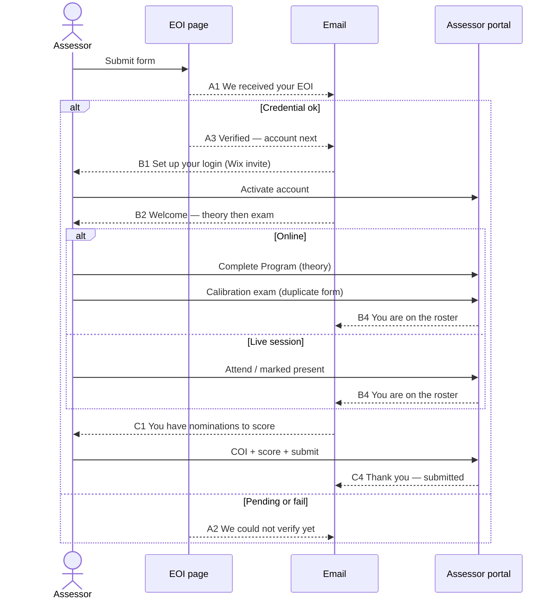

# Phase 4 — Assessor emails

**Back:** [Guide](../Assessor-EOI-Wix-Plan.md)

From **their** side: site + inbox. Organisers are silent except where named. Reminders are **email**, not Discord.

Wire **A1–A3** in [phase 1](01-eoi-landing.md). **B–C** with [phase 2](02-assessor-portal.md) / [phase 3](03-calibration.md). **D1/D2** can stay manual.

No email for browsing the EOI page, ticking COI, or saving a draft.

| ID | When | Subject | Send | Phase |
| --- | --- | --- | --- | --- |
| A1 | EOI submit | We received your PCotY assessor application | Auto (Wix form) | 1 |
| A2 | Verify fail / PMP-pending | Action needed: we could not verify your credential | Auto | 1 |
| A3 | Verify ok | You are verified — next is your assessor account | Auto | 1 |
| B1 | Admin invites member | Set up your PCotY assessor login | Wix member invite | 2 |
| B2 | `userId` set | Welcome — complete theory then the calibration exam | Auto | 3 |
| B3 | Theory or exam not done, ~7 days | Reminder: calibration is required before scoring | Auto | 3 |
| B4 | Calibration Passed | You are on the Stage 1 roster | Auto | 3 |
| C1 | Admin assigns nomination(s) | You have been assigned nominations (deadline …) | Auto | 2 |
| C2 | 7 days before deadline, not submitted | Reminder: assessment due … | Auto | 2 |
| C3 | Past deadline, not submitted | Overdue: please submit or tell us you cannot | Auto + organisers | 2 |
| C4 | They submit | Thank you — your assessment is locked | Auto | 2 |
| C5 | They flag COI | We will reassign this nomination | Auto | 2 |
| C6 | Stage 1 done | Thank you — certificate / next steps | Comms (Kris) | later |
| D1 | Waitlist | You are on the waitlist | Comms | 1 (manual ok) |
| D2 | Declined | Not this cycle — thank you | Comms | 1 (manual ok) |

From: PCotY organisers.

## Body purpose (draft later, not 15 Aug copy-deck)

| ID | Must say |
| --- | --- |
| A1 | Thanks; we will check PMP/PBP; no login yet |
| A2 | What failed (PBP number / Credly URL / name); how to reply or resubmit |
| A3 | Verified; wait for account invite; calibration comes after login |
| B1 | Wix set-password link |
| B2 | Program URL then exam URL; both required before scoring |
| B3 | Same links; they cannot be assigned until done |
| B4 | They are on the roster; wait for C1 |
| C1 | Count, deadline, portal link; COI if conflict |
| C2 / C3 | Deadline; portal link; reply if they cannot finish |
| C4 | Locked; do not share scores with nominees |
| C5 | Stop scoring this one; we reassign |
| C6 | Thanks; certificate if O1 exists |
| D1 / D2 | Waitlist vs not this cycle; no false hope |

## Done when

- [ ] A1–A3 fire on a real EOI submit (phase 1)
- [ ] B1 is the Wix invite (phase 2)
- [ ] B2–B4 follow theory/exam (phase 3)
- [ ] C1–C5 follow assignment (phase 2, after gate)
