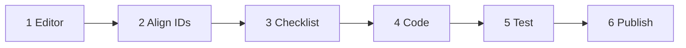
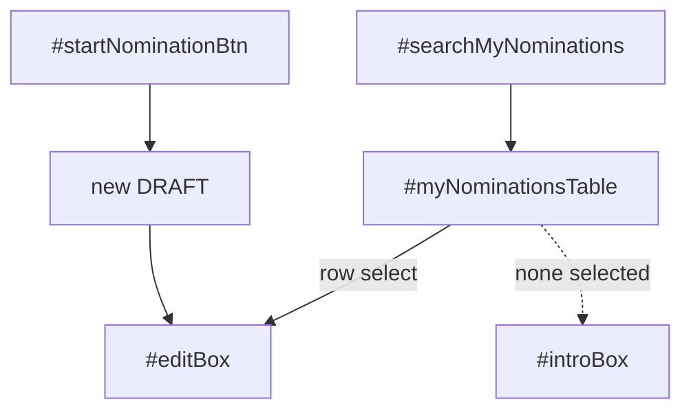

# Nominee Dashboard — list + CRUD (DR-003)

**Owner:** Peter · **Site repo:** `ittdspace/` (`github.com/baloghp/ittdspace`)  
**Rule:** [DR-003](../../Program-Plan/Decisions/DR-003-Multiple-Nominations-and-Winner-Set.md) · [live](https://ittd.atlassian.net/wiki/spaces/PBF/pages/301105153)

**Page:** Nominee Dashboard · file `src/pages/Nominee Dashboard.myj3i.js` · slug `/nominee-dashboard`  
**Award CTA:** `src/pages/Contractor Of The Year Award.z9t1g.js` (`#mainActionBtn`)

Same page. Do **not** add a second nominee page. Pattern is the Assessor portal: **list stays visible, detail opens on row select.**

The `Nominations` collection already allows many rows per `_owner`. This work is UI + talking to a chosen `_id`. Do not invent a new collection.

---


## How to use this file (order)

Do not ask Cursor for code until **Step 3** is fully ticked.


| Step  | What                                                | Who                                      |
| ----- | --------------------------------------------------- | ---------------------------------------- |
| **1** | Layout + IDs + CMS field in Local Editor, then Sync | You                                      |
| **2** | Align IDs (this file)                               | You + Cursor in chat if anything clashes |
| **3** | Pre-code checklist                                  | You                                      |
| **4** | Cursor writes page + backend                        | Cursor (after Step 3)                    |
| **5** | Test scenarios                                      | You (+ Cursor if something fails)        |
| **6** | Publish                                             | You                                      |





---


## Product (locked)

One member, many nominations. Each row is a distinct project.


| Action     | Who                                 | Behaviour                                                                                                                                      |
| ---------- | ----------------------------------- | ---------------------------------------------------------------------------------------------------------------------------------------------- |
| **List**   | Hub                                 | All of this member's packets: title, company, status                                                                                           |
| **Create** | `#startNominationBtn`               | Insert a new `DRAFT`. Open it. Never reuse an existing row.                                                                                    |
| **Read**   | Table row click                     | Load that `_id` into the existing form                                                                                                         |
| **Update** | `#saveDraftBtn` / `#submitFinalBtn` | Save **that** `_id` only. Submitted stays locked.                                                                                              |
| **Delete** | `#deleteNominationBtn`              | **Drafts only.** Confirm in the existing **Alert** lightbox, then remove the row and its customer rows. Submitted cannot be deleted this pass. |


**Out of this pass:** withdraw of a submitted packet, new Triggered Emails, category assignment UI, award-page layout (label only, in code).

**Clients:** each customer row belongs to **one** nomination. Add `nominationId` on `Customer_Feedback` (Step 1C). The Add Customer lightbox stays; Cursor will pass the open nomination's `_id` via lightbox context.

---


## Screen model

Assessor dashboard shape: list on top (always), form below (collapsed until a row is selected or created).

```
┌──────────────────────────────────────────────────────────────────────────┐
│ NOMINEE DASHBOARD                                                        │
├──────────────────────────────────────────────────────────────────────────┤
│                                                                          │
│ ═══ LIST (always) ═════════════════════════════════════════════════════ │
│                                                                          │
│  #searchMyNominations                                                    │
│  #myNominationsTable     Title | Company | Status                        │
│  #startNominationBtn     “Start another nomination”                      │
│                                                                          │
│  #introBox               shown when nothing selected                     │
│                          “Select a nomination, or start another.”        │
│                                                                          │
│ ═══ DETAIL #editBox (collapsed until selected) ════════════════════════ │
│                                                                          │
│  existing form — do not rename these IDs                                 │
│  #titleInput #companyInput #statusText #ownerText                        │
│  rich texts, consents, file upload/view/delete                           │
│  #customerTable #addCustomerBtn #deleteCustomerBtn                       │
│  #saveDraftBtn #submitFinalBtn                                           │
│  #deleteNominationBtn    drafts only; hidden when SUBMITTED              │
│  #errorMsg                                                               │
│                                                                          │
└──────────────────────────────────────────────────────────────────────────┘
```




`#loadingBox` stays as today (first paint only).

---


## Step 1 — Local Editor

Do this in Local Editor (`cd ittdspace && npm run dev`). **Sync** when the UI is right. Do not rename `Nominee Dashboard.myj3i.js` by hand.

### 1A. Keep (do not rename)

These IDs already exist and the form still uses them.


| Role        | IDs                                                                                                                                                                                |
| ----------- | ---------------------------------------------------------------------------------------------------------------------------------------------------------------------------------- |
| Shell       | `#loadingBox`, `#introBox`, `#editBox`, `#errorMsg`                                                                                                                                |
| Start       | `#startNominationBtn`                                                                                                                                                              |
| Core fields | `#titleInput`, `#companyInput`, `#statusText`, `#ownerText`                                                                                                                        |
| Narrative   | `#richTextBoxExamplary`, `#richTextBoxImpact`, `#richTextBoxLessons`                                                                                                               |
| Consents    | `#gdprCheckbox`, `#retentionCheckbox`, `#publicationCheckbox`                                                                                                                      |
| Files       | `#uploadNarrative`, `#viewNarrativeBtn`, `#deleteNarrativeBtn`, `#uploadContractMatrix`, `#viewContractBtn`, `#deleteContractBtn`, `#uploadRACI`, `#viewRaciBtn`, `#deleteRaciBtn` |
| Customers   | `#customerTable`, `#addCustomerBtn`, `#deleteCustomerBtn`                                                                                                                          |
| Save        | `#saveDraftBtn`, `#submitFinalBtn`                                                                                                                                                 |
| Lightbox    | **AddCustomerPopup** (unchanged in Editor) · **Alert** (reuse for delete confirm)                                                                                                  |


Hide or delete `#coachText` if it is still on the page (DR-002). Cursor will not write to it.

### 1B. Add (locked IDs)

Put the list **above** `#editBox`. Copy the Assessor table look if that is faster than inventing a new one.


| Control      | ID                     | Notes                                                                 |
| ------------ | ---------------------- | --------------------------------------------------------------------- |
| Search       | `#searchMyNominations` | Filter title / company / status. Same idea as `#searchAssessor`.      |
| Table        | `#myNominationsTable`  | **Not** `#customerTable`. Do not reuse the client table for the list. |
| Delete draft | `#deleteNominationBtn` | Inside `#editBox`. Label: **Delete draft**.                           |


**Table columns** — Manage Table **field keys must match** the row objects Cursor will send:


| Column header (Editor text) | Field key |
| --------------------------- | --------- |
| Title                       | `title`   |
| Company                     | `company` |
| Status                      | `status`  |


Empty title in CMS is fine; Cursor will send `title` as `"(Untitled draft)"` for display so the row is still clickable.

`#introBox` **copy** (Editor): *Select a nomination in the list, or start another.*  
`#startNominationBtn` **label** (Editor default): *Start another nomination*  
(Code will set *Start nomination* when the list is empty.)

Do **not** put `#startNominationBtn` inside `#editBox`. It belongs with the list so it stays visible while a form is open.

### 1C. CMS

- `Nominations`**:** no new fields. Do not add a unique index on `_owner`.
- `Customer_Feedback`**:** add `nominationId` (Text). Stores the parent `Nominations._id`. Not a Reference field (keeps Editor setup simple). Existing UAT rows can stay empty; Cursor will treat empty + “this member has only one packet” as legacy.

Collection permissions stay as they are (backend uses `suppressAuth` after an ownership check).

### 1D. Award page

No Editor change required. Cursor will relabel `#mainActionBtn` for nominees from **View Nomination Status** to **Your nominations**. Still goes to `/nominee-dashboard`.

### 1E. Sync

Local Editor → **Sync** so `ittdspace` sees the new elements. Confirm in Cursor that `$w('#myNominationsTable')` etc. exist (Step 3).

---


## Step 2 — Align IDs

If you could not use an ID above, write the real ID here before code. Otherwise leave this table blank.


| Planned                          | Actual (if different) |
| -------------------------------- | --------------------- |
| `#myNominationsTable`            |                       |
| `#searchMyNominations`           |                       |
| `#deleteNominationBtn`           |                       |
| `Customer_Feedback.nominationId` |                       |


---


## Step 3 — Pre-code checklist (gate)

Tick all before asking Cursor for Step 4.

- [x] List sits above the form: `#searchMyNominations` + `#myNominationsTable` + `#startNominationBtn`
- [x] Table column field keys are `title`, `company`, `status`
- [x] `#editBox` still contains the existing form IDs (1A)
- [x] `#deleteNominationBtn` is on the form, not on the list
- [x] `#startNominationBtn` is **not** inside `#editBox`
- [x] `#introBox` copy updated
- [x] `#coachText` gone or hidden
- [x] `Customer_Feedback.nominationId` exists in CMS
- [x] Local Editor **Synced** to `ittdspace`
- [x] Desktop layout checked (page is already desktop-gated)

**When all ticked:** ask Cursor to implement **Step 4**.

---


## Step 4 — Cursor (after Step 3)

Do not start this until the checklist is ticked.

### 4A. Backend (`src/backend/nomination.web.js`, `customer.web.js`)

- `getMyNominations()` — all rows for `_owner`, newest first
- `createDraftNomination()` — **always insert**; never return an existing row
- `getMyNomination(nominationId)` — that `_id`, ownership check
- `saveNomination(data, isFinal, nominationId)` — update **that** `_id` only
- `deleteDraftNomination(nominationId)` — refuse if not `DRAFT`; delete that nomination and `Customer_Feedback` rows with that `nominationId`
- Customers: `getMyCustomers(nominationId)` / `addCustomer(data, nominationId)` write and filter `nominationId`
- Submit emails: only customers for **that** nomination (legacy: owner-only rows only if this member still has a single packet)


### 4B. Nominee Dashboard page

- On load: **do not** auto-create a draft
- Show list; collapse `#editBox` until row select or Start
- Start → insert → select the new row → expand form
- Row select → load that `_id` (draft editable, submitted locked as today)
- Save/submit pass `loadedNomination._id`
- Delete draft → Alert confirm → list refresh, form collapses
- Search filters the list locally (same pattern as `NominationTableManager`)
- Add Customer lightbox: pass `{ nominationId }` as context


### 4C. Award page

- Nominee logged in: `#mainActionBtn` label **Your nominations** → `/nominee-dashboard`


### 4D. Assessor customers (small)

- `getNomineeCustomerFeedback` / `loadCustomerCards` filter by `nominationId` when opening a packet so two projects from the same firm do not mix on the assessor Customers tab.


### 4E. Leave alone

- Assessor scoring, Admin assignment, calibration, cycle countdown, desktop gate.

---


## Step 5 — Verify and test (after code)


### 5A. Smoke

- [ ] Dashboard opens with **no** surprise extra draft in CMS
- [ ] Empty list: intro + **Start nomination**; form collapsed
- [ ] Start creates **one** new `Nominations` row (`DRAFT`) and opens the form
- [ ] Refresh does **not** create another row
- [ ] Table shows title / company / status for each row


### 5B. Scenarios


| #     | Scenario                   | Steps                                                                  | Pass when                                                                    |
| ----- | -------------------------- | ---------------------------------------------------------------------- | ---------------------------------------------------------------------------- |
| N-T1  | Create two                 | Start, fill title A, save draft. Start again, fill title B, save draft | CMS has two rows for you; table shows A and B                                |
| N-T2  | Open the other             | Click A in the table                                                   | Form shows A's title, not B                                                  |
| N-T3  | Save does not clobber      | With A open, change title, save. Open B                                | B unchanged                                                                  |
| N-T4  | Submit locks one           | Submit A (files + consents + client as today). Open B                  | A locked; B still a draft                                                    |
| N-T5  | Clients stay on the packet | On A add client X. On B add client Y                                   | A's table has X only; B's has Y only; both rows have `nominationId` set      |
| N-T6  | Delete draft               | Open B (draft). Delete draft. Confirm in Alert                         | B gone from CMS and table; A still there; form back to intro                 |
| N-T7  | No delete on submitted     | Open submitted A                                                       | `#deleteNominationBtn` hidden; cannot delete                                 |
| N-T8  | Search                     | Type part of title A                                                   | Table shows A, not B                                                         |
| N-T9  | Award CTA                  | Log in as nominee; open award page; click main CTA                     | Label **Your nominations**; lands on the list                                |
| N-T10 | First-time member          | Member with Nominee role and zero rows                                 | Empty list; Start creates the first draft (same as today, but only on click) |


### 5C. Failures — what to check


| Symptom                           | Check                                                                         |
| --------------------------------- | ----------------------------------------------------------------------------- |
| Table empty but CMS has rows      | Column field keys `title` / `company` / `status`; `_owner` on the rows        |
| Start reopens the same draft      | `createDraftNomination` still has the old “if existing, return it” branch     |
| Saving A overwrites B             | `saveNomination` still queries by `_owner` instead of `_id`                   |
| Clients appear on both packets    | `nominationId` missing on `Customer_Feedback` or not passed from the lightbox |
| `$w is not a function` / ID error | Step 1 IDs not on the page or not Synced                                      |
| Extra drafts on every refresh     | Auto-create on load not removed                                               |


---


## Step 6 — Publish

- [ ] All Step 5B scenarios passed on Local Editor / preview
- [ ] Commit + push `main` inside `ittdspace/`
- [ ] `npx wix publish` **or** Publish in Local Editor (one source only)
- [ ] Spot-check live `/nominee-dashboard` with a test member

---


## Notes for Cursor (do not do until Step 3)

- Work in `ittdspace/`, not the PBF vault copy.
- Reuse `public/nominationSelectionTable.js` if the search API fits; make search optional rather than requiring a new class if that is simpler.
- `public/nominationView.js` is unused by the live dashboard; update it only if something still imports it, otherwise leave it.
- Do not create pages from the IDE.

